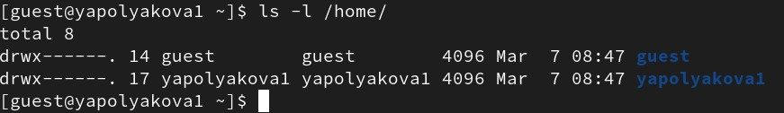
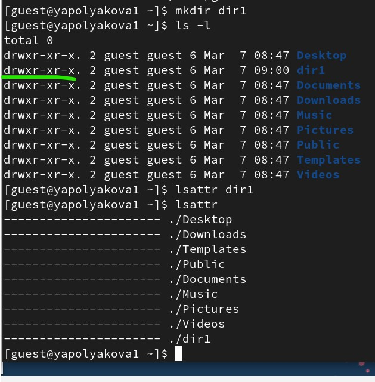
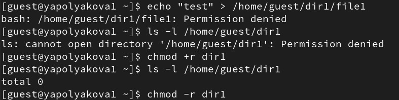

---
## Author
author:
  name: Полякова Юлия Александровна
  degrees: School
  orcid: 0009-0002-3294-7664
  email: 1132243102@rudn.ru
  affiliation:
    - name: Российский университет дружбы народов
      country: Российская Федерация
      postal-code: 117198
      city: Москва
      address: ул. Миклухо-Маклая, д. 6
## Title
title: Лабораторная работа №2
subtitle: Дискреционное разграничение прав в Linux. Основные атрибуты
license: CC BY
date: today
date-format: "YYYY-MM-DD" # Example: 2025-09-06
---

# Информация

## Докладчик

:::::::::::::: {.columns align=center}
::: {.column width="70%"}

  * Полякова Юлия Александровна
  * студент
  * группа: НКАбд-04-24
  * Российский университет дружбы народов им. П. Лумумбы
  * [1132243102@rudn.ru](mailto:1132243102@rudn.ru)
  * <https://juliamaffin123.github.io/>

:::
::: {.column width="30%"}

:::
::::::::::::::

# Вводная часть

## Актуальность

- Умение настраивать доступы полезное и нужное
- Изучение атрибутов файлов и дискреционного разграничения доступа - первый шаг к изучению основ безопасности

## Объект и предмет исследования

- Атрибуты файлов
- Дискреционное разграничение доступов
- Консоль

## Цели и задачи

Получение практических навыков работы в консоли с атрибутами файлов, закрепление теоретических основ дискреционного разграничения доступа в современных системах с открытым кодом на базе ОС Linux.

Задачи:

- Создать учетную запись guest
- Изучить атрибуты и доступы

## Материалы и методы

- Консоль
- quarto для создания презентаций и отчетов из Маркдаун

# Выполнение работы

## Создание учетной записи guest

{#fig-001 width=70%}

## Проверка текущей директории

{#fig-002 width=70%}

## Изучение имени пользователя и групп

{#fig-003 width=70%}

## Просмотр /etc/passwd

{#fig-004 width=45%}

## Просмотр существующих директорий

{#fig-005 width=70%}

## Просмотр расширенных атрибутов

{#fig-006 width=70%}

## Работаем с dir1

{#fig-007 width=50%}

## Изменение атрибутов

{#fig-008 width=70%}

## Попытка создать файл

{#fig-009 width=70%}

## Тест доступов для таблиц

{#fig-010 width=35%}

## Таблица 2.1 (1)

<small>

| Права директории | Права файла | Создание файла | Удаление файла | Запись в файл | Чтение файла | Смена директории | Просмотр файлов в директории | Пере-имено-вание файла | Смена атри-бутов файла |
|---|---|---|---|---|---|---|---|---|---|
| d (000) | (000) | - | - | - | - | - | - | - | - |
| d--x (100) | (000) | - | - | - | - | + | - | - | - |
| d-w- (200) | (000) | - | - | - | - | - | - | - | - |
| d-wx (300) | (000) | + | + | - | - | + | - | + | - |
| dr-- (400) | (000) | - | - | - | - | - | + | - | - |
| dr-x (500) | (000) | - | - | - | - | + | + | - | - |
| drw- (600) | (000) | - | - | - | - | - | + | - | - |
| drwx (700) | (000) | + | + | - | - | + | + | + | - |

: Установленные права и разрешённые действия {#tbl21}

</small>

## Таблица 2.1 (2)

<small>

| Права директории | Права файла | Создание файла | Удаление файла | Запись в файл | Чтение файла | Смена директории | Просмотр файлов в директории | Пере-имено-вание файла | Смена атри-бутов файла |
|---|---|---|---|---|---|---|---|---|---|
| d (000) | (400) | - | - | - | - | - | - | - | - |
| d--x (100) | (400) | - | - | - | + | + | - | - | - |
| d-w- (200) | (400) | - | - | - | - | - | - | - | - |
| d-wx (300) | (400) | + | + | - | + | + | - | + | - |
| dr-- (400) | (400) | - | - | - | - | - | + | - | - |
| dr-x (500) | (400) | - | - | - | + | + | + | - | - |
| drw- (600) | (400) | - | - | - | - | - | + | - | - |
| drwx (700) | (400) | + | + | - | + | + | + | + | - |

</small>

## Таблица 2.1 (3)

<small>

| Права директории | Права файла | Создание файла | Удаление файла | Запись в файл | Чтение файла | Смена директории | Просмотр файлов в директории | Пере-имено-вание файла | Смена атри-бутов файла |
|---|---|---|---|---|---|---|---|---|---|
| d (000) | (600) | - | - | - | - | - | - | - | - |
| d--x (100) | (600) | - | - | + | - | + | - | - | - |
| d-w- (200) | (600) | - | - | - | - | - | - | - | - |
| d-wx (300) | (600) | + | + | + | - | + | - | + | - |
| dr-- (400) | (600) | - | - | - | - | - | + | - | - |
| dr-x (500) | (600) | - | - | + | - | + | + | - | - |
| drw- (600) | (600) | - | - | - | - | - | + | - | - |
| drwx (700) | (600) | + | + | + | - | + | + | + | - |

</small>

## Таблица 2.1 (4)

<small>

| Права директории | Права файла | Создание файла | Удаление файла | Запись в файл | Чтение файла | Смена директории | Просмотр файлов в директории | Пере-имено-вание файла | Смена атри-бутов файла |
|---|---|---|---|---|---|---|---|---|---|
| d (000) | (700) | - | - | - | - | - | - | - | - |
| d--x (100) | (700) | - | - | + | + | + | - | - | - |
| d-w- (200) | (700) | - | - | - | - | - | - | - | - |
| d-wx (300) | (700) | + | + | + | + | + | - | + | - |
| dr-- (400) | (700) | - | - | - | - | - | + | - | - |
| dr-x (500) | (700) | - | - | + | + | + | + | - | - |
| drw- (600) | (700) | - | - | - | - | - | + | - | - |
| drwx (700) | (700) | + | + | + | + | + | + | + | + |

</small>

## Таблица 2.2

<small>

| Операция | Минимальные права на директорию | Минимальные права на файл |
|---|---|---|
| Создание файла | d-wx (300) | --- (000) |
| Удаление файла | d-wx (300) | --- (000) |
| Чтение файла | d--x (100) | r-- (400) |
| Запись в файл | d--x (100) | -w- (200) |
| Переименование файла | d-wx (300) | --- (000) |
| Создание поддиректории | d-wx (300) | --- (000) |
| Удаление поддиректории | d-wx (300) | --- (000) |

: Минимальные права для совершения операций {#tbl22}

</small>

## Важные пояснения:
 
1) **Для создания/удаления/переименования файлов и поддиректорий** нужно право на запись (w) и выполнение (x) для директории, а права на сам файл не имеют значения
 
2) **Для чтения файла** нужно право на выполнение (x) для директории и право на чтение (r) для файла
 
3) **Для записи в файл** нужно право на выполнение (x) для директории и право на запись (w) для файла
 
4) **Право на выполнение (x) для директории** критически важно - без него нельзя получить доступ к содержимому директории
 
5) **Право на чтение (r) для директории** позволяет только просматривать список файлов, но не взаимодействовать с ними без права на выполнение

# Выводы

## Результат

Мы получили практические навыки работы в консоли с атрибутами файлов, закрепили теоретические основ дискреционного разграничения доступа в современных системах с открытым кодом на базе ОС Linux.

