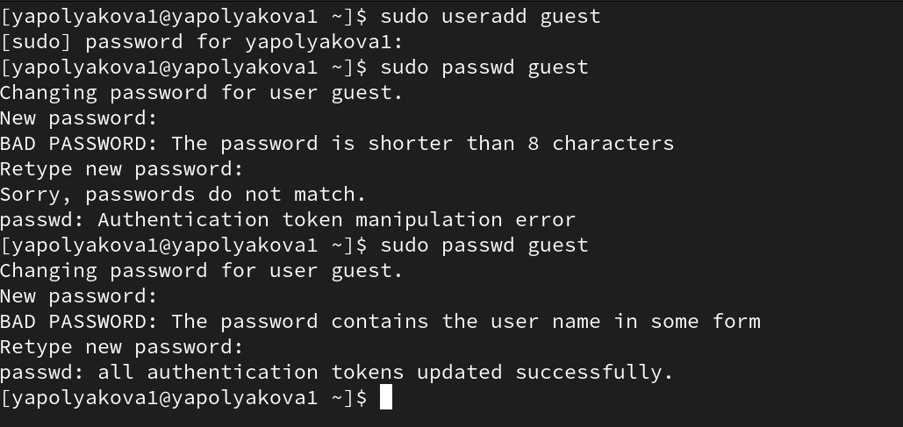
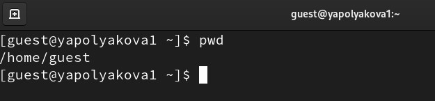
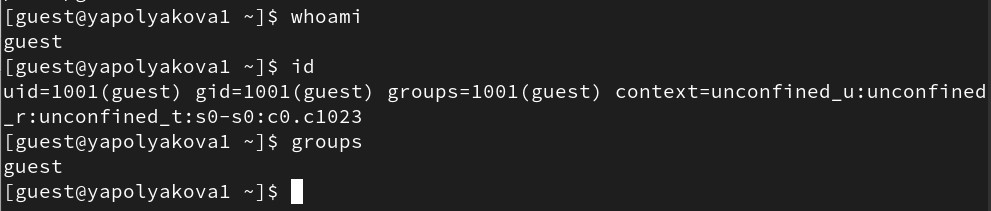
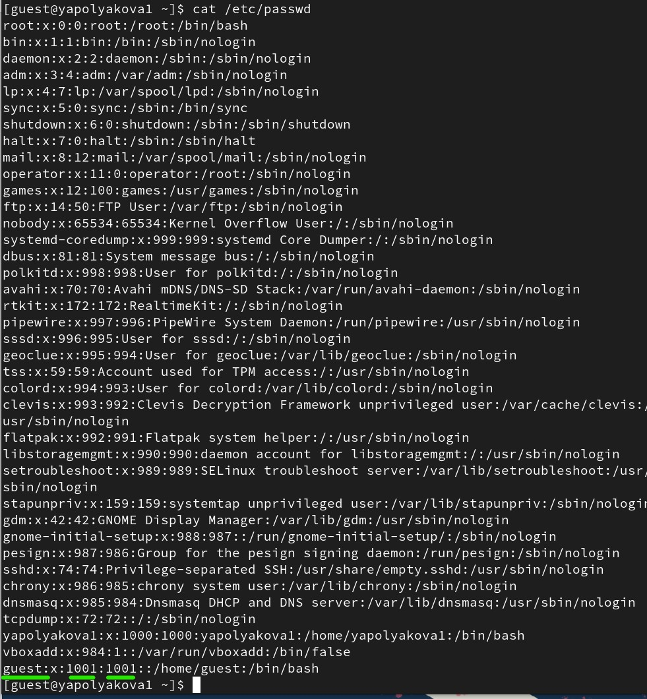
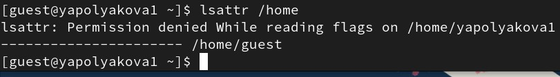
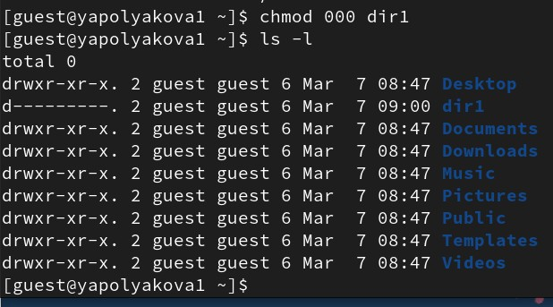
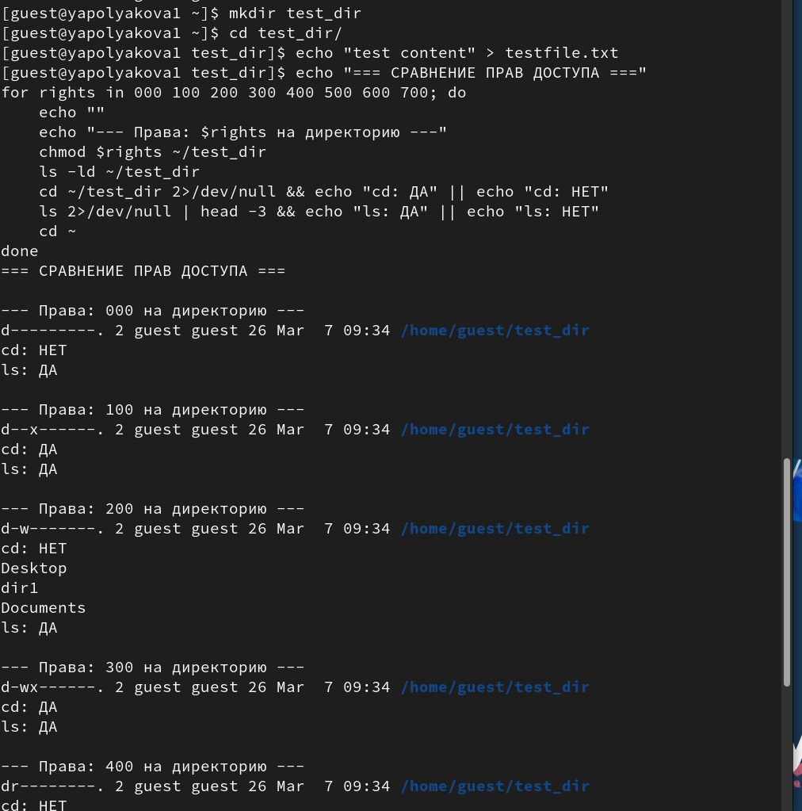

---
## Author
author:
  name: Полякова Юлия Александровна
  degrees: School
  orcid: 0009-0002-3294-7664
  email: 1132243102@rudn.ru
  affiliation:
    - name: Российский университет дружбы народов
      country: Российская Федерация
      postal-code: 117198
      city: Москва
      address: ул. Миклухо-Маклая, д. 6

## Title
title: "Лабораторная работа №1"
subtitle: "Установка и конфигурация операционной системы на виртуальную машину"
license: "CC BY"
---

# Цель работы

Получение практических навыков работы в консоли с атрибутами файлов, закрепление теоретических основ дискреционного разграничения доступа в современных системах с открытым кодом на базе ОС Linux.

# Выполнение лабораторной работы

1. Создаем учетную запись пользователя guest (используем учётную запись администратора): **sudo useradd guest**. Задаем пароль для пользователя guest (используем учётную запись администратора): **sudo passwd guest** ([рис. @fig-001]).

{#fig-001 width=70%}

2. Входим в систему, как guest. Определяем текущую директорию: **pwd**. Это действительно домашняя директория, в терминале она обозначается "~" ([рис. @fig-002]).

{#fig-002 width=70%}

3. Уточняем имя пользователя командой **whoami**, и группы командами **id** и **groups**. Итог:  uid=1001, gid=1001 (guest). Команда groups показывает только guest. В приглашении командной строки используется имя пользователя и группа guest ([рис. @fig-003]).

{#fig-003 width=70%}

4. Просматриваем файл /etc/passwd командой **cat /etc/passwd**. Находим uid=1001, gid=1001. Значения совпадают с предыдущими пунктами ([рис. @fig-004]).

{#fig-004 width=70%}

5. Определяем существующие в системе директории командой **ls -l /home/**. Удалось получить список поддиректорий директории /home. Ка-
кие права установлены на директориях: чтение, запись и взаимодействие ([рис. @fig-005]).

{#fig-005 width=70%}

6. Пробуем команду проверки расширенных атрибутов **lsattr /home**, удалось увидет только для guest, для других пользователей нет доступа ([рис. @fig-006]).

{#fig-006 width=70%}

7. Создаем поддиректорию командой **mkdir dir1**. Определяем права доступа командой **ls -l** (drwxr-xr-x) и расширенные атрибуты командой **lsattr** (их нет) ([рис. @fig-007]).

{#fig-007 width=70%}

8. Снимаем все атрибуты командой **chmod 000 dir1** и проверяем помощью правильность выполнения командой **ls -l** ([рис. @fig-008]).

{#fig-008 width=70%}

9. Пытаемся создать в директории dir1 файл file1 командой **echo "test" > /home/guest/dir1/file1**. Мы получили отказ, так как у нас нет доступа (убрали в предыдущем пункте). Файл не создался из-за отсутствия доступа, поэтому вышла ошибка. Мы вернули доступ на чтение и проверили, что фал действительно не создалс командой **ls -l /home/guest/dir1** ([рис. @fig-009]).

{#fig-009 width=70%}

10. Заполняем таблицы о доступах опытным путем ([рис. @fig-010]).

{#fig-010 width=70%}

11. Составляем таблицу "Установленные права и разрешённые действия" [табл. @tbl21]:
 
| Права директории | Права файла | Создание файла | Удаление файла | Запись в файл | Чтение файла | Смена директории | Просмотр файлов в директории | Пере-имено-вание файла | Смена атри-бутов файла |
|---|---|---|---|---|---|---|---|---|---|
| d (000) | (000) | - | - | - | - | - | - | - | - |
| d--x (100) | (000) | - | - | - | - | + | - | - | - |
| d-w- (200) | (000) | - | - | - | - | - | - | - | - |
| d-wx (300) | (000) | + | + | - | - | + | - | + | - |
| dr-- (400) | (000) | - | - | - | - | - | + | - | - |
| dr-x (500) | (000) | - | - | - | - | + | + | - | - |
| drw- (600) | (000) | - | - | - | - | - | + | - | - |
| drwx (700) | (000) | + | + | - | - | + | + | + | - |
| d (000) | (400) | - | - | - | - | - | - | - | - |
| d--x (100) | (400) | - | - | - | + | + | - | - | - |
| d-w- (200) | (400) | - | - | - | - | - | - | - | - |
| d-wx (300) | (400) | + | + | - | + | + | - | + | - |
| dr-- (400) | (400) | - | - | - | - | - | + | - | - |
| dr-x (500) | (400) | - | - | - | + | + | + | - | - |
| drw- (600) | (400) | - | - | - | - | - | + | - | - |
| drwx (700) | (400) | + | + | - | + | + | + | + | - |
| d (000) | (600) | - | - | - | - | - | - | - | - |
| d--x (100) | (600) | - | - | + | - | + | - | - | - |
| d-w- (200) | (600) | - | - | - | - | - | - | - | - |
| d-wx (300) | (600) | + | + | + | - | + | - | + | - |
| dr-- (400) | (600) | - | - | - | - | - | + | - | - |
| dr-x (500) | (600) | - | - | + | - | + | + | - | - |
| drw- (600) | (600) | - | - | - | - | - | + | - | - |
| drwx (700) | (600) | + | + | + | - | + | + | + | - |
| d (000) | (700) | - | - | - | - | - | - | - | - |
| d--x (100) | (700) | - | - | + | + | + | - | - | - |
| d-w- (200) | (700) | - | - | - | - | - | - | - | - |
| d-wx (300) | (700) | + | + | + | + | + | - | + | - |
| dr-- (400) | (700) | - | - | - | - | - | + | - | - |
| dr-x (500) | (700) | - | - | + | + | + | + | - | - |
| drw- (600) | (700) | - | - | - | - | - | + | - | - |
| drwx (700) | (700) | + | + | + | + | + | + | + | + |

: Установленные права и разрешённые действия {#tbl21}
 
Составляем таблицу "Минимальные права для совершения операций" [табл. @tbl22]:
 
| Операция | Минимальные права на директорию | Минимальные права на файл |
|---|---|---|
| Создание файла | d-wx (300) | --- (000) |
| Удаление файла | d-wx (300) | --- (000) |
| Чтение файла | d--x (100) | r-- (400) |
| Запись в файл | d--x (100) | -w- (200) |
| Переименование файла | d-wx (300) | --- (000) |
| Создание поддиректории | d-wx (300) | --- (000) |
| Удаление поддиректории | d-wx (300) | --- (000) |

: Минимальные права для совершения операций {#tbl22}

**Важные пояснения:**
 
1) **Для создания/удаления/переименования файлов и поддиректорий** нужно право на запись (w) и выполнение (x) для директории, а права на сам файл не имеют значения
 
2) **Для чтения файла** нужно право на выполнение (x) для директории и право на чтение (r) для файла
 
3) **Для записи в файл** нужно право на выполнение (x) для директории и право на запись (w) для файла
 
4) **Право на выполнение (x) для директории** критически важно - без него нельзя получить доступ к содержимому директории
 
5) **Право на чтение (r) для директории** позволяет только просматривать список файлов, но не взаимодействовать с ними без права на выполнение

# Выводы

Мы получили практические навыки работы в консоли с атрибутами файлов, закрепили теоретические основ дискреционного разграничения доступа в современных системах с открытым кодом на базе ОС Linux.

# Список литературы{.unnumbered}

::: {#refs}
:::
