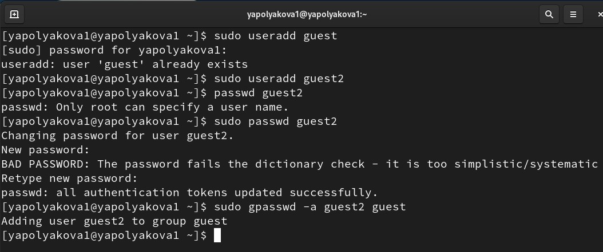
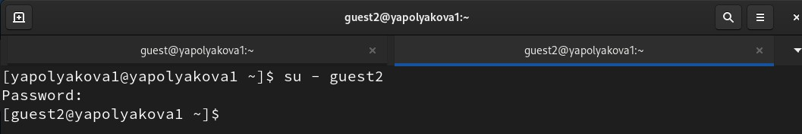
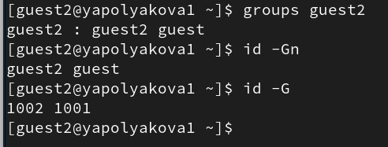
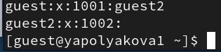
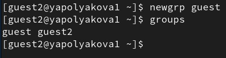
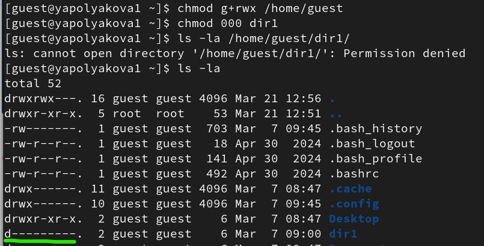
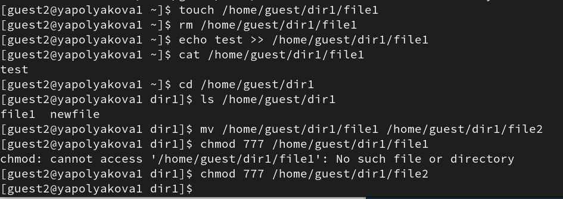

---
## Author
author:
  name: Полякова Юлия Александровна
  degrees: School
  orcid: 0009-0002-3294-7664
  email: 1132243102@rudn.ru
  affiliation:
    - name: Российский университет дружбы народов
      country: Российская Федерация
      postal-code: 117198
      city: Москва
      address: ул. Миклухо-Маклая, д. 6
## Title
title: Лабораторная работа №3
subtitle: Дискреционное разграничение прав в Linux. Два пользователя
license: CC BY
date: today
date-format: "YYYY-MM-DD" # Example: 2025-09-06
---

# Информация

## Докладчик

:::::::::::::: {.columns align=center}
::: {.column width="70%"}

  * Полякова Юлия Александровна
  * студент
  * группа: НКАбд-04-24
  * Российский университет дружбы народов им. П. Лумумбы
  * [1132243102@rudn.ru](mailto:1132243102@rudn.ru)
  * <https://juliamaffin123.github.io/>

:::
::: {.column width="30%"}

:::
::::::::::::::

# Вводная часть

## Актуальность

- Умение настраивать доступы полезное и нужное
- Изучение групп пользователей и дискреционного разграничения доступа - первый шаг к изучению основ безопасности

## Объект и предмет исследования

- Пользователи и группы пользователей
- Дискреционное разграничение доступов
- Консоль

## Цели и задачи

Получение практических навыков работы в консоли с атрибутами файлов для групп пользователей.

Задачи:

- Создать учетные записи guest и guest2
- Изучить группы пользователей и доступы

## Материалы и методы

- Консоль
- quarto для создания презентаций и отчетов из Маркдаун

# Выполнение работы

## Создание пользователей guest и guest2

{#fig-001 width=60%}

## Вход в систему от двух пользователей

{#fig-002 width=70%}

## Определяем текущую директорию 1

{#fig-003 width=60%}

## Определяем текущую директорию 2

{#fig-004 width=60%}

## Уточняем группы пользователя guest ([рис. @fig-005])

{#fig-005 width=60%}

## Уточняем имя пользователя guest2

{#fig-006 width=60%}

## Просматриваем /etc/group

{#fig-007 width=60%}

## Регистрируем guest2 в группе guest

{#fig-008 width=60%}

## Меняем права доступа к директориям

{#fig-009 width=60%}

## Даем доступ в guest (1)

{#fig-010 width=70%}

## Проверяем доступ в guest2 (1)

{#fig-011 width=60%}

## Даем доступ в guest (2)

{#fig-012 width=70%}

## Проверяем доступ в guest2 (2)

{#fig-013 width=60%}

## Таблица 3.1

<small>

| Права директории | Права файла | Создание файла | Удаление файла | Запись в файл | Чтение файла | Смена директории | Просмотр файлов в директории | Пере-имено-вание файла | Смена атри-бутов файла |
|---|---|---|---|---|---|---|---|---|---|
| 000 | 000 | - | - | - | - | - | - | - | - |
| 000 | 010 | - | - | - | - | - | - | - | - |
| 000 | 020 | - | - | - | - | - | - | - | - |
| ... | ... | ... | ... | ... | ... | ... | ... | ... | ... |
| 070 | 040 | + | + | - | + | + | + | + | + |
| 070 | 050 | + | + | - | + | + | + | + | + |
| 070 | 060 | + | + | + | + | + | + | + | + |
| 070 | 070 | + | + | + | + | + | + | + | + |

: Установленные права и разрешённые действия для групп {#tbl21}

## Таблица 3.2

<small>

| Операция | Минимальные права на директорию | Минимальные права на файл |
|---|---|---|
| Создание файла | wx | — |
| Удаление файла | wx | — |
| Запись в файл | x | w |
| Чтение файла | x | r |
| Переименование файла | wx | — |
| Создание поддиректории | wx | — |
| Удаление поддиректории | wx | — |

: Минимальные права для совершения операций от имени пользователей входящих в группу {#tbl22}

</small>

# Выводы

## Результат

Мы получили практические навыки работы в консоли с атрибутами файлов для групп пользователей.
