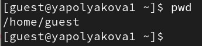
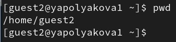
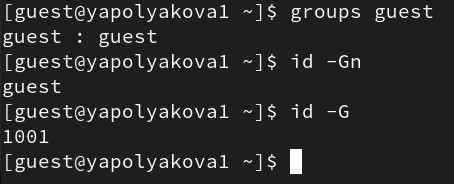
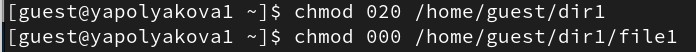
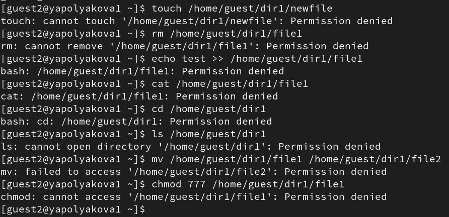
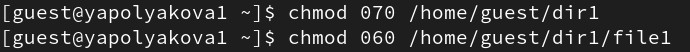

---
## Author
author:
  name: Полякова Юлия Александровна
  degrees: ---
  orcid: 0009-0002-3294-7664
  email: 1132243102@rudn.ru
  affiliation:
    - name: Российский университет дружбы народов
      country: Российская Федерация
      postal-code: 117198
      city: Москва
      address: ул. Миклухо-Маклая, д. 6

## Title
title: "Лабораторная работа №3"
subtitle: "Дискреционное разграничение прав в Linux. Два пользователя"
license: "CC BY"
---

# Цель работы

Получение практических навыков работы в консоли с атрибутами файлов для групп пользователей.

# Выполнение лабораторной работы

1. Создаем учетную запись пользователя guest (используем учётную запись администратора): **sudo useradd guest**. Задаем пароль для пользователя guest (используем учётную запись администратора): **sudo passwd guest** (это было создано в прошлой ЛР), повторяем для guest2. Добавляем пользователя guest2 в группу guest командой **gpasswd -a guest2 guest** ([рис. @fig-001])

{#fig-001 width=70%}

2. Делим терминал на две вкладки клавишами Ctrl+Shift+T. Входим в систему, как guest в первой консоли, команда **su - guest**. Входим в систему, как guest2 во второй консоли, команда **su - guest2**.([рис. @fig-002]).

{#fig-002 width=70%}

3. Определяем текущую директорию пользователя guest: **pwd**. Это домашняя директория этого пользователя, в приглашении она обозначается "~" ([рис. @fig-003]).

{#fig-003 width=70%}

4. Определяем текущую директорию пользователя guest2: **pwd**. Это домашняя директория этого пользователя, в приглашении она обозначается "~" ([рис. @fig-004]).

{#fig-004 width=70%}

5. Уточняем имя пользователя - guest (можно еще проверить командой **whoami**), его группу - guest (команда **groups guest**), к каким группам принадлежит сам - guest (команда **id -Gn**). Сравниваем с выводом команд **id -Gn** и **id -G**, но вторая выводит id. ([рис. @fig-005])

{#fig-005 width=70%}

6. Уточняем имя пользователя - guest2 (можно еще проверить командой **whoami**), его группы - guest2 и guest (команда **groups guest2**), к каким группам принадлежит сам - guest2 и guest (команда **id -Gn**). Сравниваем с выводом команд **id -Gn** и **id -G**, но вторая выводит id двух групп, в которых состоит пользователь. ([рис. @fig-006]).

{#fig-006 width=70%}

7. Сравниваем полученную информацию с содержимым файла /etc/group. Просматриваем файл командой
**cat /etc/group**. Информация в нем соответствует той, что получили ранее ([рис. @fig-007]).

{#fig-007 width=70%}

8. От имени пользователя guest2 выполняем регистрацию пользователя guest2 в группе guest командой **newgrp guest**. Можем заметить, что вперед теперь вышла группа guest ([рис. @fig-008]).

{#fig-008 width=70%}

9. От имени пользователя guest изменяем права директории /home/guest, разрешив все действия для пользователей группы: **chmod g+rwx /home/guest**. От имени пользователя guest снимаем с директории /home/guest/dir1 все атрибуты командой **chmod 000 dirl** и проверяем правильность снятия атрибутов ([рис. @fig-009]).

{#fig-009 width=70%}

10. Чтобы составить таблицу для каждой строки в пользователе guest даем или забираем права ([рис. @fig-010]) и ([рис. @fig-012]), затем в пользователе guest2 различными командами проверяем возможность выполнения команд ([рис. @fig-011]) и ([рис. @fig-013]).

{#fig-010 width=70%}

{#fig-011 width=70%}

{#fig-012 width=70%}

{#fig-013 width=70%}

11. Составляем таблицу "Установленные права и разрешённые действия для групп" [табл. @tbl21]:

| Права директории | Права файла | Создание файла | Удаление файла | Запись в файл | Чтение файла | Смена директории | Просмотр файлов в директории | Пере-имено-вание файла | Смена атри-бутов файла |
|---|---|---|---|---|---|---|---|---|---|
| 000 | 000 | - | - | - | - | - | - | - | - |
| 000 | 010 | - | - | - | - | - | - | - | - |
| 000 | 020 | - | - | - | - | - | - | - | - |
| 000 | 030 | - | - | - | - | - | - | - | - |
| 000 | 040 | - | - | - | - | - | - | - | - |
| 000 | 050 | - | - | - | - | - | - | - | - |
| 000 | 060 | - | - | - | - | - | - | - | - |
| 000 | 070 | - | - | - | - | - | - | - | - |
| 010 | 000 | - | - | - | - | + | - | - | + |
| 010 | 010 | - | - | - | - | + | - | - | + |
| 010 | 020 | - | - | - | - | + | - | - | + |
| 010 | 030 | - | - | - | - | + | - | - | + |
| 010 | 040 | - | - | - | - | + | - | - | + |
| 010 | 050 | - | - | - | - | + | - | - | + |
| 010 | 060 | - | - | - | - | + | - | - | + |
| 010 | 070 | - | - | - | - | + | - | - | + |
| 020 | 000 | - | - | - | - | - | - | - | - |
| 020 | 010 | - | - | - | - | - | - | - | - |
| 020 | 020 | - | - | - | - | - | - | - | - |
| 020 | 030 | - | - | - | - | - | - | - | - |
| 020 | 040 | - | - | - | - | - | - | - | - |
| 020 | 050 | - | - | - | - | - | - | - | - |
| 020 | 060 | - | - | - | - | - | - | - | - |
| 020 | 070 | - | - | - | - | - | - | - | - |
| 030 | 000 | + | + | - | - | + | - | + | + |
| 030 | 010 | + | + | - | - | + | - | + | + |
| 030 | 020 | + | + | - | - | + | - | + | + |
| 030 | 030 | + | + | - | - | + | - | + | + |
| 030 | 040 | + | + | - | - | + | - | + | + |
| 030 | 050 | + | + | - | - | + | - | + | + |
| 030 | 060 | + | + | - | - | + | - | + | + |
| 030 | 070 | + | + | - | - | + | - | + | + |
| 040 | 000 | - | - | - | - | - | + | - | - |
| 040 | 010 | - | - | - | - | - | + | - | - |
| 040 | 020 | - | - | - | - | - | + | - | - |
| 040 | 030 | - | - | - | - | - | + | - | - |
| 040 | 040 | - | - | - | - | - | + | - | - |
| 040 | 050 | - | - | - | - | - | + | - | - |
| 040 | 060 | - | - | - | - | - | + | - | - |
| 040 | 070 | - | - | - | - | - | + | - | - |
| 050 | 000 | - | - | - | - | + | + | - | + |
| 050 | 010 | - | - | - | - | + | + | - | + |
| 050 | 020 | - | - | - | - | + | + | - | + |
| 050 | 030 | - | - | - | - | + | + | - | + |
| 050 | 040 | - | - | - | + | + | + | - | + |
| 050 | 050 | - | - | - | + | + | + | - | + |
| 050 | 060 | - | - | + | + | + | + | - | + |
| 050 | 070 | - | - | + | + | + | + | - | + |
| 060 | 000 | - | - | - | - | - | + | - | - |
| 060 | 010 | - | - | - | - | - | + | - | - |
| 060 | 020 | - | - | - | - | - | + | - | - |
| 060 | 030 | - | - | - | - | - | + | - | - |
| 060 | 040 | - | - | - | - | - | + | - | - |
| 060 | 050 | - | - | - | - | - | + | - | - |
| 060 | 060 | - | - | - | - | - | + | - | - |
| 060 | 070 | - | - | - | - | - | + | - | - |
| 070 | 000 | + | + | - | - | + | + | + | + |
| 070 | 010 | + | + | - | - | + | + | + | + |
| 070 | 020 | + | + | - | - | + | + | + | + |
| 070 | 030 | + | + | - | - | + | + | + | + |
| 070 | 040 | + | + | - | + | + | + | + | + |
| 070 | 050 | + | + | - | + | + | + | + | + |
| 070 | 060 | + | + | + | + | + | + | + | + |
| 070 | 070 | + | + | + | + | + | + | + | + |

: Установленные права и разрешённые действия для групп {#tbl21}
 
Составляем таблицу "Минимальные права для совершения операций от имени пользователей входящих в группу" [табл. @tbl22]:

| Операция | Минимальные права на директорию | Минимальные права на файл |
|---|---|---|
| Создание файла | wx | — |
| Удаление файла | wx | — |
| Запись в файл | x | w |
| Чтение файла | x | r |
| Переименование файла | wx | — |
| Создание поддиректории | wx | — |
| Удаление поддиректории | wx | — |

: Минимальные права для совершения операций от имени пользователей входящих в группу {#tbl22}

В предыдущей лабораторной работе мы проверяли возможность выполнения различных команд в рамках одного пользователя, поэтому мы давали разные права именно для пользователя. Сейчас мы рассматривали, как дать или закрыть другому пользователю доступ к выполнению различных команд с файлами или директориями в рамках группы пользователей. 

# Выводы

Мы получили практические навыки работы в консоли с атрибутами файлов для групп пользователей.

# Список литературы{.unnumbered}

::: {#refs}
:::
