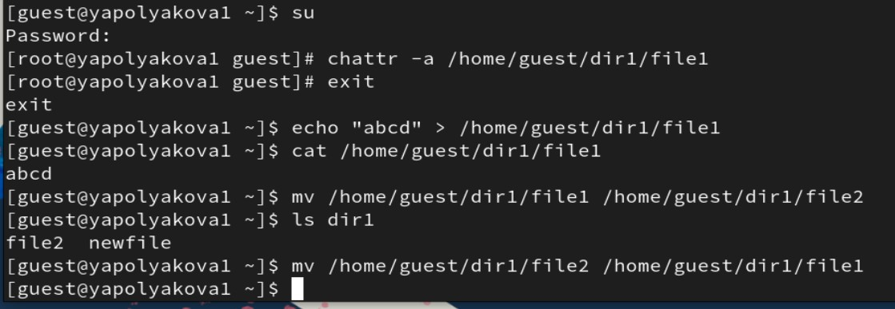
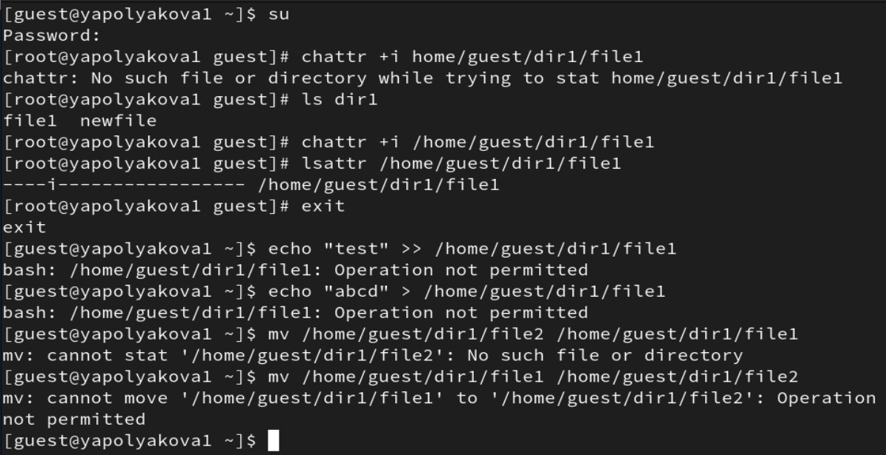

---
## Author
author:
  name: Полякова Юлия Александровна
  degrees: School
  orcid: 0009-0002-3294-7664
  email: 1132243102@rudn.ru
  affiliation:
    - name: Российский университет дружбы народов
      country: Российская Федерация
      postal-code: 117198
      city: Москва
      address: ул. Миклухо-Маклая, д. 6
## Title
title: Лабораторная работа №4
subtitle: Дискреционное разграничение прав в Linux. Расширенные атрибуты
license: CC BY
date: today
date-format: "YYYY-MM-DD" # Example: 2025-09-06
---

# Информация

## Докладчик

:::::::::::::: {.columns align=center}
::: {.column width="70%"}

  * Полякова Юлия Александровна
  * студент
  * группа: НКАбд-04-24
  * Российский университет дружбы народов им. П. Лумумбы
  * [1132243102@rudn.ru](mailto:1132243102@rudn.ru)
  * <https://juliamaffin123.github.io/>

:::
::: {.column width="30%"}

:::
::::::::::::::

# Вводная часть

## Актуальность

- Изучение расширенных атрибутов файла - один из шагов к изучению основ безопасности

## Объект и предмет исследования

- Расширенные атрибуты файла
- Дискреционное разграничение доступов
- Консоль

## Цели и задачи

Получение практических навыков работы в консоли с расширенными атрибутами файлов.

Задачи:

- От пользователя guest установить расширеннный атрибут на файл
- Проверить возможные действия при атрибуте a и i

## Материалы и методы

- Консоль
- quarto для создания презентаций и отчетов из Markdown

# Выполнение работы

## Устанавливаем расширенный атрибут а

От имени пользователя guest определяем расширенные атрибуты файла. Устанавливаем командой права, разрешающие чтение и запись для владельца файла. Пробуем установить расширенный атрибут a. В ответ получаем отказ от выполнения операции. Повышаем свои права с помощью команды su. Пробуем еще раз установить атрибут a от имени суперпользователя. От пользователя guest проверяем правильность установления.

{#fig-001 width=40%}

## Дозапись в файл file1

Выполняем дозапись в файл file1 слова «test». После этого выполняем чтение файла. Убеждаемся, что слово test было успешно записано.

{#fig-002 width=50%}

## Попытка стереть или переименовать файл

Пробуем стереть имеющуюся в file1 информацию. Пробуем переименовать файл. Выполнить команды не удается, так как нет доступа.

{#fig-003 width=50%}

## Попытка дать доступ

Пробуем на файл file1 права, например, запрещающие чтение и запись для владельца файла. Успешно выполнить указанные команды не удалось.

{#fig-004 width=50%}

## Снимаем атрибут a, выполняем предыдущие команды

Снимаем расширенный атрибут a с файла от имени суперпользователя. Повторяем операции, которые ранее не удавалось выполнить, теперь они возможны.

{#fig-005 width=45%}

## Повторяем с атрибутом i

Повторяем действия по шагам, заменив атрибут «a» атрибутом «i». Никакие команды не удается выполнить, потому что этот атрибут это специальный файловый атрибут, который запрещает изменение, удаление, переименование или создание жестких ссылок на файл/каталог

{#fig-006 width=40%}

## Вывод

Мы опробовали на практике действие расширенных атрибутов файла «а» и «i».
