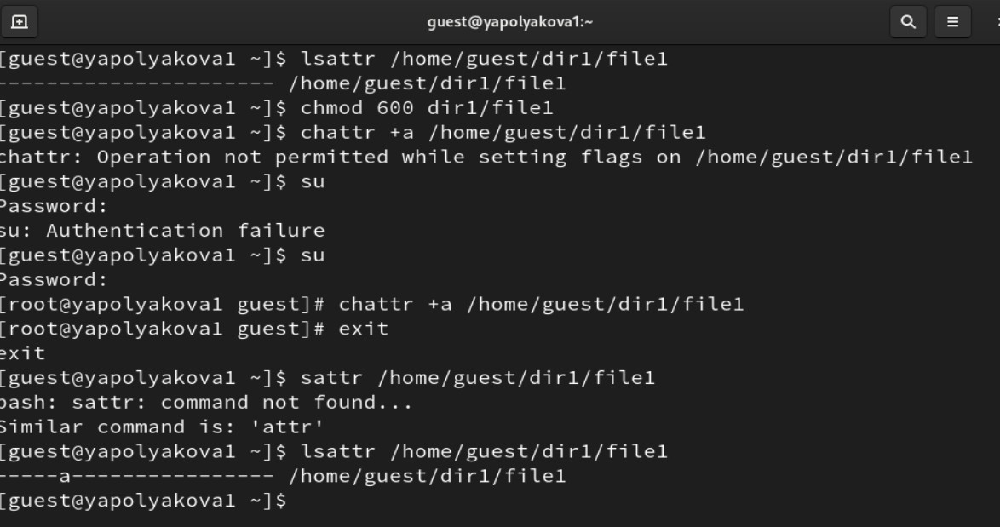
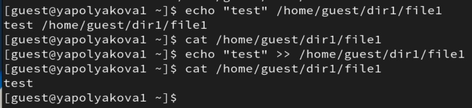
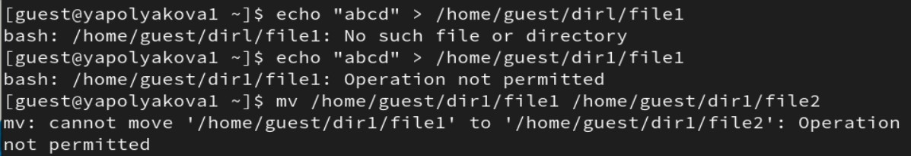
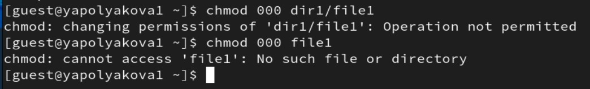

---
## Author
author:
  name: Полякова Юлия Александровна
  degrees: ---
  orcid: 0009-0002-3294-7664
  email: 1132243102@rudn.ru
  affiliation:
    - name: Российский университет дружбы народов
      country: Российская Федерация
      postal-code: 117198
      city: Москва
      address: ул. Миклухо-Маклая, д. 6

## Title
title: "Лабораторная работа №4"
subtitle: "Дискреционное разграничение прав в Linux. Расширенные атрибуты"
license: "CC BY"
---

# Цель работы

Получение практических навыков работы в консоли с расширенными атрибутами файлов.

# Выполнение лабораторной работы

1. От имени пользователя guest определяем расширенные атрибуты файла /home/guest/dir1/file1 командой **lsattr /home/guest/dir1/file1**. Устанавливаем командой **chmod** на файл file1 права, разрешающие чтение и запись для владельца файла. Пробуем установить на файл /home/guest/dir1/file1 расширенный атрибут a от имени пользователя guest: **chattr +a /home/guest/dir1/file1**. В ответ получаем отказ от выполнения операции. Повышаем свои права с помощью команды su. Пробуем установить расширенный атрибут a на файл /home/guest/dir1/file1 от имени суперпользователя: **chattr +a /home/guest/dir1/file1**. От пользователя guest проверяем правильность установления атрибута: **lsattr /home/guest/dir1/file1** ([рис. @fig-001])

{#fig-001 width=70%}

2. Выполняем дозапись в файл file1 слова «test» командой **echo "test" /home/guest/dir1/file1**. После этого выполняем чтение файла file1 командой **cat /home/guest/dir1/file1**. Убеждаемся, что слово test было успешно записано в file1. ([рис. @fig-002]).

{#fig-002 width=70%}

3. Пробуем стереть имеющуюся в file1 информацию командой **echo "abcd" > /home/guest/dirl/file1**. Пробуем переименовать файл. Выполнить команды не удается, так как нет доступа ([рис. @fig-003]).

{#fig-003 width=70%}

4. Пробуем с помощью команды **chmod 000 file1** установить на файл file1 права, например, запрещающие чтение и запись для владельца файла. Успешно выполнить указанные команды не удалось ([рис. @fig-004]).

{#fig-004 width=70%}

5. Снимаем расширенный атрибут a с файла /home/guest/dirl/file1 от имени суперпользователя командой **chattr -a /home/guest/dir1/file1**. Повторяем операции, которые ранее не удавалось выполнить, теперь они возможны ([рис. @fig-005]).

{#fig-005 width=70%}

6. Повторяем действия по шагам, заменив атрибут «a» атрибутом «i». Никакие команды не удается выполнить, потому что этот атрибут это специальный файловый атрибут, который запрещает изменение, удаление, переименование или создание жестких ссылок на файл/каталог [@sedicomm] ([рис. @fig-006]).

{#fig-006 width=70%}

# Выводы

Мы опробовали на практике действие расширенных атрибутов «а» и «i».

# Список литературы{.unnumbered}

::: {#refs}
:::
