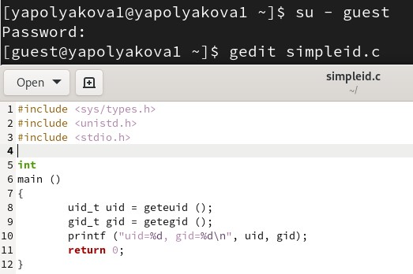
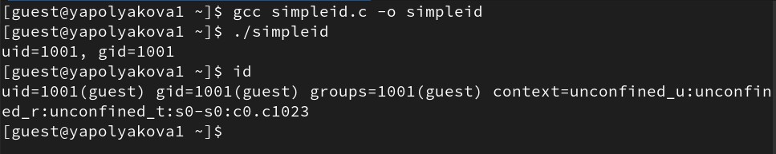
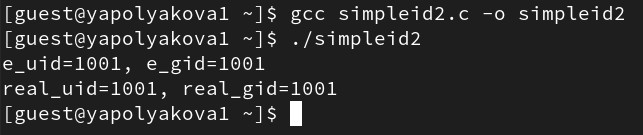
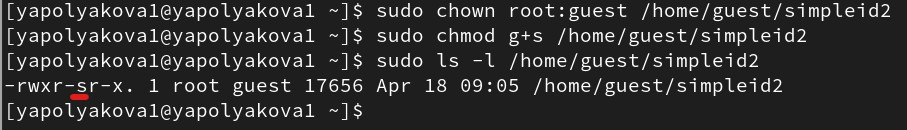
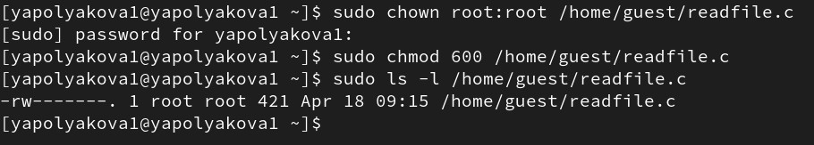
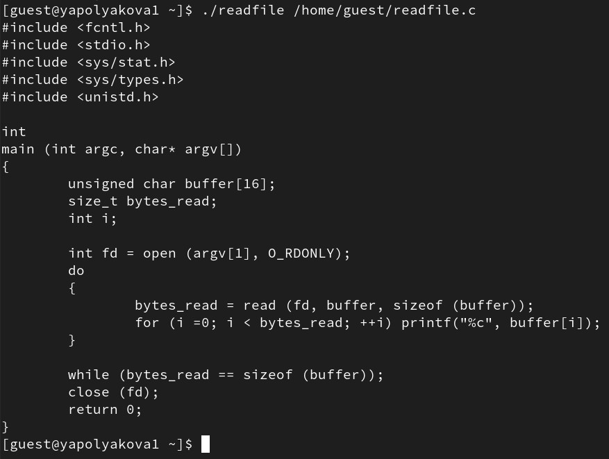
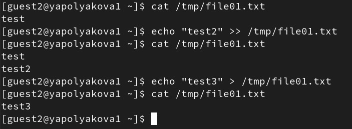

---
## Author
author:
  name: Полякова Юлия Александровна
  degrees: School
  orcid: 0009-0002-3294-7664
  email: 1132243102@rudn.ru
  affiliation:
    - name: Российский университет дружбы народов
      country: Российская Федерация
      postal-code: 117198
      city: Москва
      address: ул. Миклухо-Маклая, д. 6
## Title
title: Лабораторная работа №5
subtitle: Дискреционное разграничение прав в Linux. Исследование влияния дополнительных атрибутов
license: CC BY
date: today
date-format: "YYYY-MM-DD" # Example: 2025-09-06
---

# Информация

## Докладчик

:::::::::::::: {.columns align=center}
::: {.column width="70%"}

  * Полякова Юлия Александровна
  * студент
  * группа: НКАбд-04-24
  * Российский университет дружбы народов им. П. Лумумбы
  * [1132243102@rudn.ru](mailto:1132243102@rudn.ru)
  * <https://juliamaffin123.github.io/>

:::
::: {.column width="30%"}

:::
::::::::::::::

# Вводная часть

## Актуальность

- Изучение SetUID- и Sticky-битов - один из шагов к изучению основ безопасности

## Объект и предмет исследования

- SetUID-бит
- SetGID-бит
- Дискреционное разграничение доступов
- Консоль

## Цели и задачи

Изучение механизмов изменения идентификаторов, применения SetUID- и Sticky-битов. Получение практических навыков работы в консоли с дополнительными атрибутами. Рассмотрение работы механизма смены идентификатора процессов пользователей, а также влияние бита Sticky на запись и удаление файлов.

Задачи:

- Написать несколько программ и проверить их работу относительно доступов
- Исследовать Sticky-бит

## Материалы и методы

- Консоль
- quarto для создания презентаций и отчетов из Markdown

# Выполнение работы

## Подготовка среды

Подготавливаем среду. Проверяем наличие gcc. Проверяем, что домашняя директория смонтирована без атрибута nosuid. Отключаем SELinux

{#fig-001 width=30%}

## Программа simpleid.c

Создаем программу simpleid.c

{#fig-002 width=45%}

## Выполнение программы simpleid

Компилируем программу, выполняем, сравниваем с id

{#fig-003 width=60%}

## Программа simpleid2.c

Усложняем программу, добавив вывод действительных идентификаторов

{#fig-004 width=40%}

## Выполнение программы simpleid2

Компилируем и запускаем simpleid2.c

{#fig-005 width=60%}

## Установка новых атрибутов 1

Устанавливаем SetUID-бит. Используем sudo или su

{#fig-006 width=60%}

## Проверка влияния SetUID-бита

Еще раз запускаем simpleid2, сравниваем с id

{#fig-007 width=60%}

## Установка новых атрибутов 2

Теперь поставим в атрибуты SetGID-бит

{#fig-008 width=60%}

## Проверка влияния SetGID-бита

Запускаем simpleid2 для SetGID-бита

{#fig-009 width=60%}

## Программа readfile.c

Создаем программу readfile.c

{#fig-010 width=35%}

## Компиляция readfile.c

Компилируем readfile.c

{#fig-011 width=60%}

## Установка новых атрибутов 3

Сменяем владельца у файла readfile.c и изменяем права так, чтобы только суперпользователь (root) мог прочитать его, a guest не мог

{#fig-012 width=60%}

## Проверяем возможность чтения файла

{#fig-013 width=60%}

## Установка SetUID-бита на программу

Устанавливаем на скомпилированную прогамму SetUID-бит

{#fig-014 width=60%}

## Проверка влияния SetUID-бита на чтение файлов 1

Теперь программа readfile может читать файл readfile.c

{#fig-015 width=30%}

## Проверка влияния SetUID-бита на чтение файлов 2

И /etc/shadow тоже читается с помощью readfile

{#fig-016 width=60%}

## Проверка атрибута Sticky

Проверяем установлен ли атрибут Sticky на директории /tmp, создаем файл file01.txt в директории /tmp со словом test, смотрим атрибуты файла, добавляем чтение и запись для "всех остальных", еще раз проверяем атрибуты

{#fig-017 width=35%}

## Изучаем влияние Sticky

От пользователя guest2 (не являющегося владельцем) пробуем прочитать, дозаписать, перезаписать информацию в файле file01.txt

{#fig-018 width=40%}

## Проверка удаления со Sticky, убираем Sticky

От guest2 пробуем удалить файл. Повышаем свои права и убираем этот атрибут с папки /tmp

{#fig-019 width=40%}

## Добавляем доступы

Повторяем предыдущие шаги - даем доступы, теперь работаем с файлом file02.txt

{#fig-020 width=60%}

## Проверка действий без Sticky

Повторяем предыдущие шаги, теперь удалось и удалить файл. Возвращаем Sticky в /tmp

{#fig-021 width=40%}

## Вывод

Мы изучили механизмы изменения идентификаторов, применение SetUID- и Sticky-битов. Мы получили практические навыки работы в консоли с дополнительными атрибутами. Рассмотрели работу механизма смены идентификатора процессов пользователей, а также влияние бита Sticky на запись и удаление файлов.
