---
## Author
author:
  name: Полякова Юлия Александровна
  degrees: ---
  orcid: 0009-0002-3294-7664
  email: 1132243102@rudn.ru
  affiliation:
    - name: Российский университет дружбы народов
      country: Российская Федерация
      postal-code: 117198
      city: Москва
      address: ул. Миклухо-Маклая, д. 6

## Title
title: "Лабораторная работа №5"
subtitle: "Дискреционное разграничение прав в Linux. Исследование влияния дополнительных атрибутов"
license: "CC BY"
---

# Цель работы

Изучение механизмов изменения идентификаторов, применения SetUID- и Sticky-битов. Получение практических навыков работы в консоли с дополнительными атрибутами. Рассмотрение работы механизма смены идентификатора процессов пользователей, а также влияние бита Sticky на запись и удаление файлов.

# Выполнение лабораторной работы

1. Подготавливаем среду. Проверяем наличие gcc командой проверки версии **gcc -v**. Командой **mount | grep home** проверяем, что домашняя директория смонтирована без атрибута nosuid. Отключаем SELinux командой **sudo setenforce 0** от имени суперпользователя. После этого команда **getenforce** должна выводить Permissive ([рис. @fig-001])

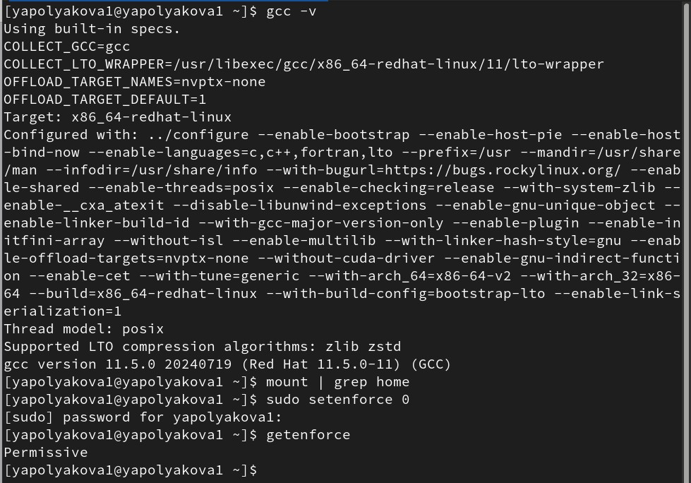{#fig-001 width=70%}

2. Заходим под пользователем guest: **su - guest**. Создаем программу simpleid.c (был использован редактор gedit) ([рис. @fig-002]).

{#fig-002 width=70%}

3. Компилируем программу: **gcc simpleid.c -o simpleid**. Выполняем: **./simpleid**. Сравниваем с **id**: Все id определены верно, без лишней информации. ([рис. @fig-003]).

{#fig-003 width=70%}

4. Усложняем программу, добавив вывод действительных идентификаторов ([рис. @fig-004]).

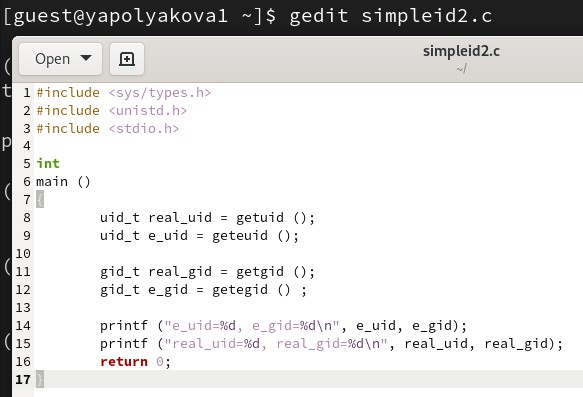{#fig-004 width=70%}

5. Компилируем и запускаем simpleid2.c: **gcc simpleid2.c -o simpleid2**, **./simpleid2** ([рис. @fig-005]).

{#fig-005 width=70%}

6. От имени суперпользователя выполняем команды: **chown root:guest /home/guest/simpleid2**, **chmod u+s /home/guest/simpleid2**. То есть устанавливаем SetUID-бит. Используем sudo (позволяет выполнять действия от имени суперпользователя, su повышает права до прав, какой su мы напишем) ([рис. @fig-006]).

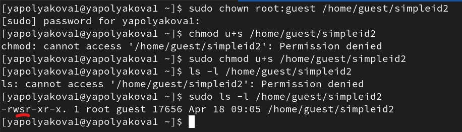{#fig-006 width=70%}

7. Теперь еще раз запускаем simpleid2, сравниваем с id, видим, что e_uid поменялся и стал 0 ([рис. @fig-007]).

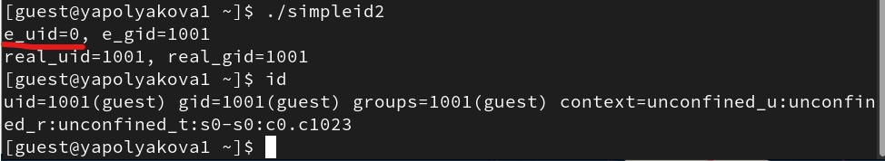{#fig-007 width=70%}

8. Теперь поставим в атрибуты SetGID-бит ([рис. @fig-008]).

{#fig-008 width=70%}

9. Запускаем simpleid2 для SetGID-бита, видим, что в сранении с id ничего не поменялось ([рис. @fig-009]).

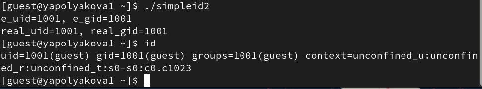{#fig-009 width=70%}

10. Создаем программу readfile.c ([рис. @fig-010]).

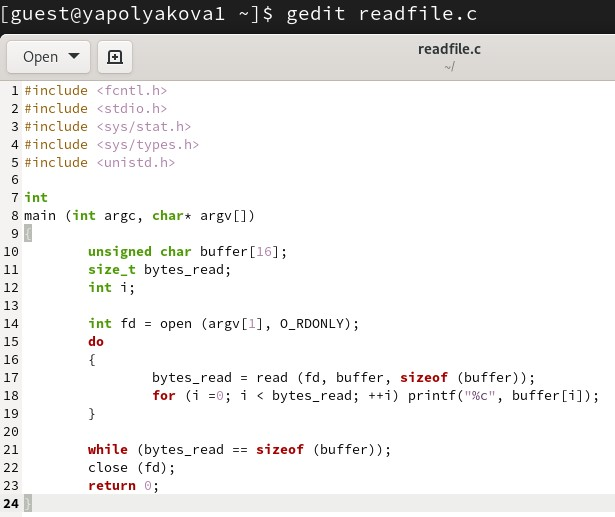{#fig-010 width=70%}

11. Компилируем readfile.c ([рис. @fig-011]).

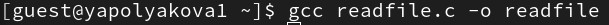{#fig-011 width=70%}

12. Сменяем владельца у файла readfile.c и изменяем права так, чтобы только суперпользователь (root) мог прочитать его, a guest не мог ([рис. @fig-012]).

{#fig-012 width=70%}

13. Проверяем возможность чтения файла readfile.c командой cat ([рис. @fig-013]).

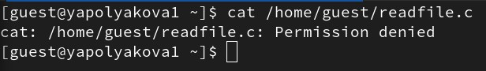{#fig-013 width=70%}

14. Устанавливаем на скомпилированную прогамму SetUID-бит ([рис. @fig-014]).

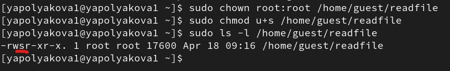{#fig-014 width=70%}

15. Теперь программа readfile может читатать файл readfile.c ([рис. @fig-015]).

{#fig-015 width=70%}

16. И /etc/shadow тоже читается с помощью readfile. Все потому, что мы дали ему доступ уровня рута ([рис. @fig-016]).

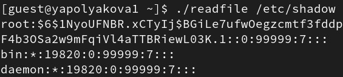{#fig-016 width=70%}

17. Проверяем установлен ли атрибут Sticky на директории /tmp, командой **ls -l / | grep tmp**. От имени пользователя guest создаем файл file01.txt в директории /tmp со словом test: **echo "test" > /tmp/file01.txt**. Смотрим атрибуты файла, добавляем чтение и запись для "всех остальных", еще раз проверяем атрибуты ([рис. @fig-017]).

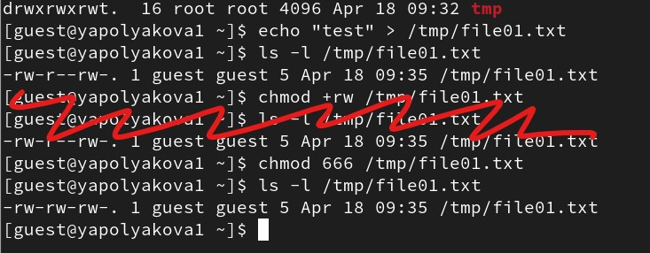{#fig-017 width=70%}

18. От пользователя guest2 (не являющегося владельцем) пробуем прочитать, дозаписать, перезаписать информацию в файле file01.txt Все удалось выполнить ([рис. @fig-018]).

{#fig-018 width=70%}

19. От guest2 пробуем удалить файл: **rm /tmp/fileOl.txt**. Не получается. Поэтому повышаем свои права и убираем этот атрибут с папки /tmp. ([рис. @fig-019]).

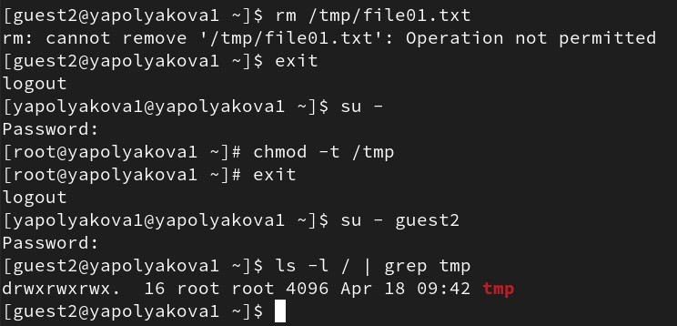{#fig-019 width=70%}

20. Повторяем предыдущие шаги - даем доступы, теперь работаем с файлом file02.txt ([рис. @fig-020]).

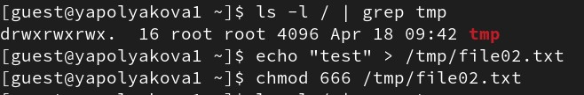{#fig-020 width=70%}

21. Повторяем предыдущие шаги, теперь удалось и удалить файл. Возвращаем Sticky в /tmp. ([рис. @fig-021]).

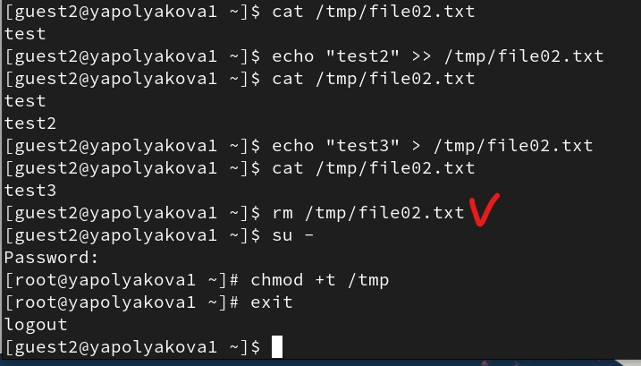{#fig-021 width=70%}

# Выводы

Мы изучили механизмы изменения идентификаторов, применение SetUID- и Sticky-битов. Мы получили практические навыки работы в консоли с дополнительными атрибутами. Рассмотрели работу механизма смены идентификатора процессов пользователей, а также влияние бита Sticky на запись и удаление файлов.

# Список литературы{.unnumbered}

::: {#refs}
:::
