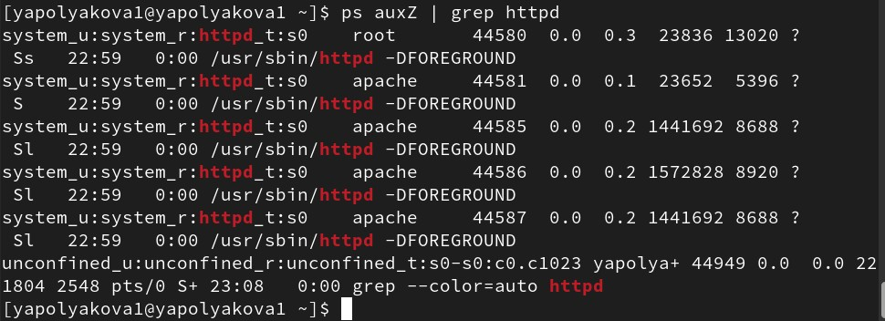
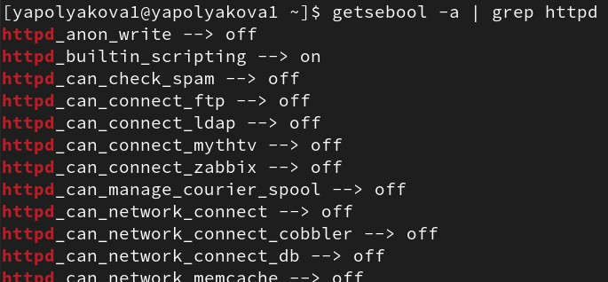
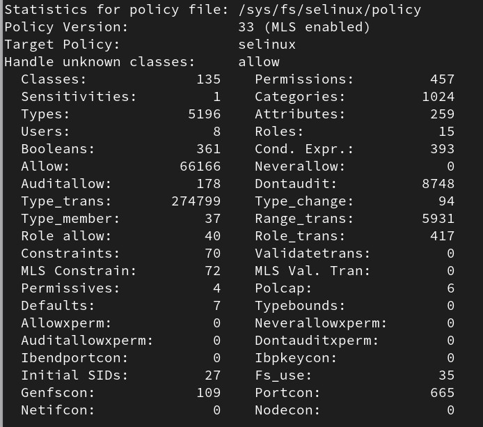
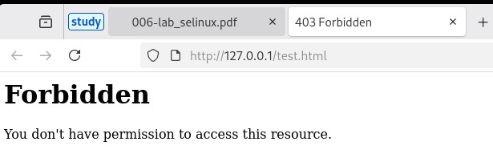
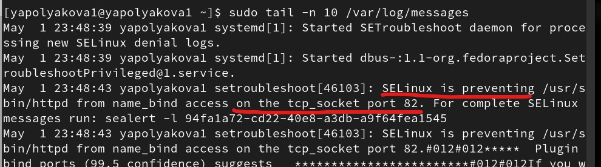
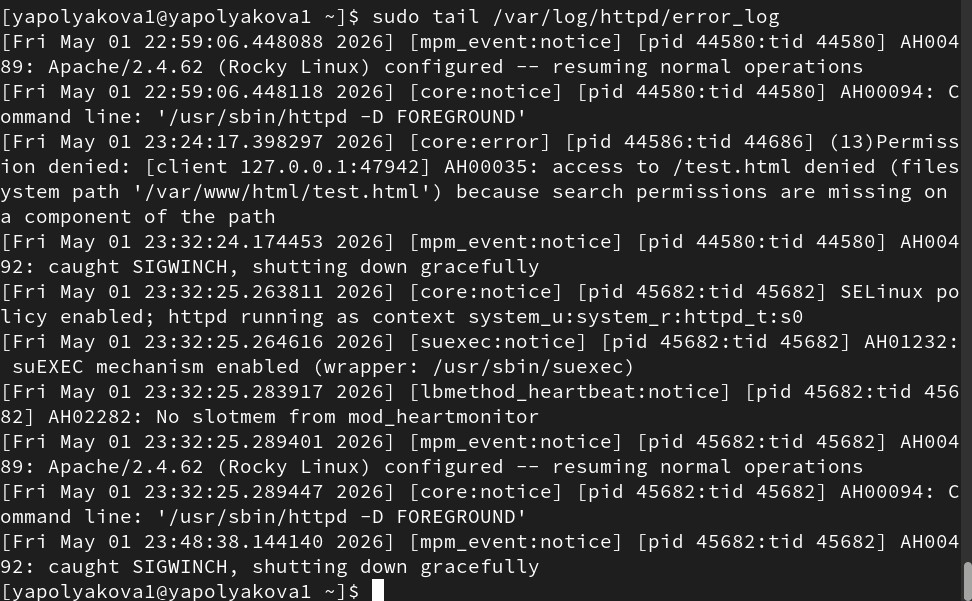
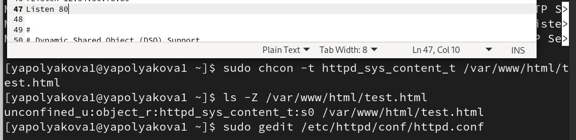

---
## Author
author:
  name: Полякова Юлия Александровна
  degrees: School
  orcid: 0009-0002-3294-7664
  email: 1132243102@rudn.ru
  affiliation:
    - name: Российский университет дружбы народов
      country: Российская Федерация
      postal-code: 117198
      city: Москва
      address: ул. Миклухо-Маклая, д. 6
## Title
title: Лабораторная работа №6
subtitle: Мандатное разграничение прав в Linux
license: CC BY
date: today
date-format: "YYYY-MM-DD" # Example: 2025-09-06
---

# Информация

## Докладчик

:::::::::::::: {.columns align=center}
::: {.column width="70%"}

  * Полякова Юлия Александровна
  * студент
  * группа: НКАбд-04-24
  * Российский университет дружбы народов им. П. Лумумбы
  * [1132243102@rudn.ru](mailto:1132243102@rudn.ru)
  * <https://juliamaffin123.github.io/>

:::
::: {.column width="30%"}

:::
::::::::::::::

# Вводная часть

## Актуальность

- SELinux - одна из ключевых технологий администрирования и безопасности в Linux, поэтому важно умент ьс ней работать

## Объект и предмет исследования

- SELinux
- Контексты безопасности и порты сервера Apache

## Цели и задачи

Развить навыки администрирования ОС Linux. Получить первое практическое знакомство с технологией SELinux. Проверить работу SELinx на практике совместно с веб-сервером Apache.

Задачи:

- Изучить параметры SELinux и Apache
- Создать на сервере html-файл
- Проверить влияние SELinux на доступ к файлу через браузер с разными контекстами и портами

## Материалы и методы

- Консоль
- SELinux
- веб-сервер Apache
- веб-браузер

# Выполнение работы

## Проверка режимов SELinux

{#fig-001 width=50%}

## Проверка активности сервера

{#fig-002 width=50%}

## Контекст безопасности сервера

Контекст безопасности веб-сервера Apache: system_u:system_r:httpd_t:s0

{#fig-003 width=50%}

## Переключатели SELinux

{#fig-004 width=50%}

## Статистика по политике

{#fig-005 width=35%}

## Информация о файлах, директориях и доступах

Тип файлов и поддиректорий в /var/www: cgi-bin, html. В /var/www/html нет файлов. Только root разрешено создание файлов в директории /var/www/html

{#fig-006 width=50%}

## Создание html-файла и проверка его контекста

Создаем html-файл test.html Контекст этого файла unconfined_u:object_r:httpd_sys_content_t:s0

{#fig-007 width=60%}

## Проверка файла через браузер

Обращаемся к файлу через веб-сервер, введя в браузере адрес http://127.0.0.1/test.html

{#fig-008 width=70%}

## Меняем на контекст без доступа

Изменяем контекст файла /var/www/html/test.html на samba_share_t

{#fig-009 width=70%}

## Проверка ошибки

Пробуем ещё раз получить доступ к файлу через веб-сервер

{#fig-010 width=70%}

## Просмотр лога ошибки

Смотрим log-файл, видим, что SELinux не дает серверу доступа к файлу (потому что мы ранее поменяли контекст)

{#fig-011 width=40%}

## Замена порта прослушивания

Так получилось, что в системе у меня также разрешен порт 81, поэтому и с ним сервер запустился. Для демонстрации задания ставим веб-сервер на прослушивание порта 82. В конфигурационном файле меняем Listen 80 на Listen 82

{#fig-012 width=60%}

## Сбой сервера

{#fig-013 width=45%}

## Анализ log-файла

SELinux ограничивает доступ сервера по порту 82. То есть сбой произошел из-за отсутствия доступа

{#fig-014 width=50%}

## Проверка дугих log-файлов

В файле /var/log/http/error_log также видим ошибку, а вот в access_log и в /var/log/audit/audit.log не появилось ничего нового

{#fig-015 width=30%}

## Добавление порта 82 и перезапуск сервера

Добавляем порт 82 в группу с доступными портами, перезапускаем сервер, он запустился. Это понятно, потому что теперь SELinux разрешает обращение сервера по этому порту 82

{#fig-016 width=30%}

## Возвращаем контекст и прослушку порта 80

Возвращаем контекст httpd_sys_cоntent_t, теперь файл доступен через браузер. Возвращаем Listen 80 в конфигурационном файле

{#fig-017 width=50%}

## Возвращаем в начальное состояние

Удаляем привязку http_port_t к 82 порту. Удаляем файл /var/www/html/test.html

{#fig-018 width=30%}

## Вывод

Мы развили навыки администрирования ОС Linux. Получили первое практическое знакомство с технологией SELinux.

Проверили работу SELinx на практике совместно с веб-сервером Apache.
