---
## Author
author:
  name: Полякова Юлия Александровна
  degrees: ---
  orcid: 0009-0002-3294-7664
  email: 1132243102@rudn.ru
  affiliation:
    - name: Российский университет дружбы народов
      country: Российская Федерация
      postal-code: 117198
      city: Москва
      address: ул. Миклухо-Маклая, д. 6

## Title
title: "Лабораторная работа №6"
subtitle: "Мандатное разграничение прав в Linux"
license: "CC BY"
---

# Цель работы

Развить навыки администрирования ОС Linux. Получить первое практическое знакомство с технологией SELinux.

Проверить работу SELinx на практике совместно с веб-сервером Apache.

# Выполнение лабораторной работы

1. Входим в систему, проверяем, что SELinux работает в режиме enforcing политики targeted с помощью ко-
манд getenforce и sestatus ([рис. @fig-001])

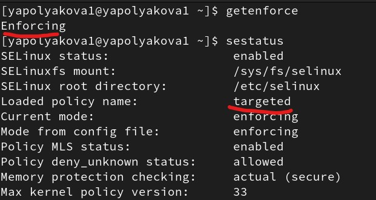{#fig-001 width=70%}

2. Проверяем, что веб-сервер запущен командой sudo systemctl status httpd ([рис. @fig-002]).

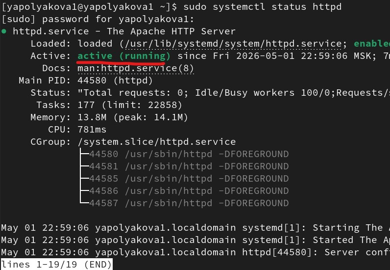{#fig-002 width=70%}

3. Определяем контекст безопасности веб-сервера Apache командой ps auxZ | grep httpd. Результат - system_u:system_r:httpd_t:s0 ([рис. @fig-003]).

{#fig-003 width=70%}

4. Смотрим текущее состояние переключателей SELinux для Apache с помощью команды getsebool -a | grep httpd, многие переключатели действительно в положении off ([рис. @fig-004]).

{#fig-004 width=70%}

5. Смотрим статистику по политике командой seinfo ([рис. @fig-005]).

{#fig-005 width=70%}

6. Определяем тип файлов и поддиректорий, находящихся в директории /var/www, с помощью команды ls -lZ /var/www (cgi-bin, html). Определяем тип файлов, находящихся в директории /var/www/html: ls -lZ /var/www/html (там нет файлов). Определяем круг пользователей, которым разрешено создание файлов в директории /var/www/html: ls -ldZ /var/www/html (только root). ([рис. @fig-006]).

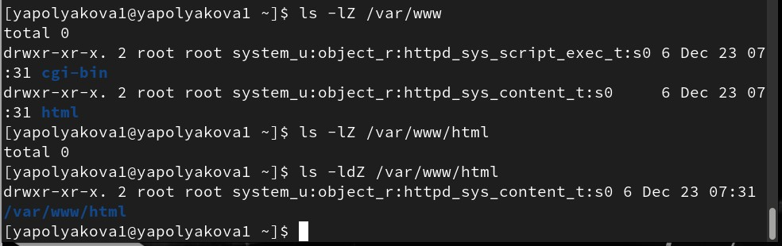{#fig-006 width=70%}

7. Создаем от имени суперпользователя (так как в дистрибутиве после установки только ему разрешена запись в директорию) html-файл /var/www/html/test.html следующего содержания ([рис. @fig-007]):

```html
<html>
<body>test</body>
</html>
```

Проверяем контекст этого файла командой ls -lZ /var/www/html/test.html (unconfined_u:object_r:httpd_sys_content_t:s0)

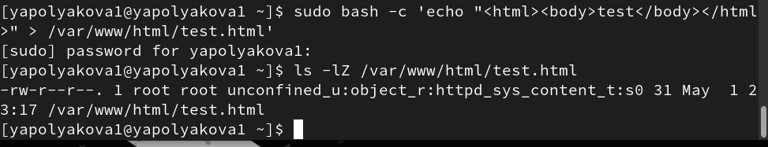{#fig-007 width=70%}

8. Обращаемся к файлу через веб-сервер, введя в браузере адрес http://127.0.0.1/test.html. Файл был успешно отображён. ([рис. @fig-008]).

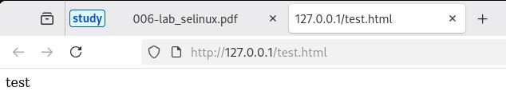{#fig-008 width=70%}

После была изучена справка man httpd_selinux. Рассмотрим полученный контекст детально. Так как по умолчанию пользователи CentOS являются свободными от типа (unconfined в переводе с англ. означает свободный), созданному нами файлу test.html был сопоставлен SELinux, пользователь unconfined_u. Это первая часть контекста.

Далее политика ролевого разделения доступа RBAC используется процессами, но не файлами, поэтому роли не имеют никакого значения для файлов. Роль object_r используется по умолчанию для файлов на «постоянных» носителях и на сетевых файловых системах. (В директории /ргос файлы, относящиеся к процессам, могут иметь роль system_r.

Тип httpd_sys_content_t позволяет процессу httpd получить доступ к файлу. Благодаря наличию последнего типа мы получили доступ к файлу при обращении к нему через браузер.

9. Изменяем контекст файла /var/www/html/test.html с httpd_sys_content_t на любой другой, к которому процесс httpd не должен иметь доступа, например, на samba_share_t: команда sudo chcon -t samba_share_t /var/www/html/test.html и ls -Z /var/www/html/test.html ([рис. @fig-009]).

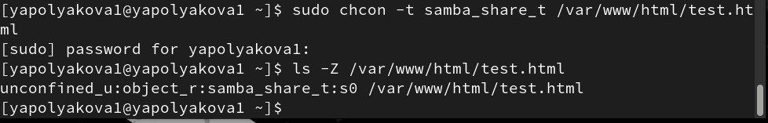{#fig-009 width=70%}

10. Пробуем ещё раз получить доступ к файлу через веб-сервер, введя в браузере адрес http://127.0.0.1/test.html. Получаем сообщение об ошибке: Forbidden You don't have permission to access /test.html on this server. ([рис. @fig-010]).

{#fig-010 width=70%}

11. Проверяем, почему файл не отображен, даже если есть все доступы на чтение r--. Смотрим log-файл командой sudo tail /var/log/messages, видим ошибку, что SELinux не дает серверу доступа к файлу (аотому что мы ранее поменяли контекст) ([рис. @fig-011]).

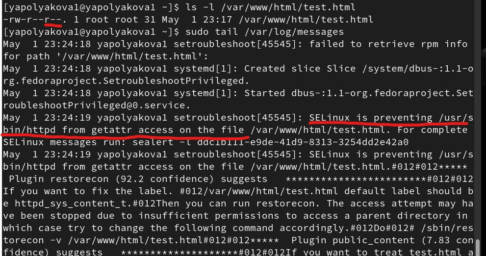{#fig-011 width=70%}

12. Так получилось, что в системе у меня также разрешен порт 81, поэтому и с ним сервер запустился. Для демонстрации задания ставим веб-сервер на прослушивание порта 82. В конфигурационном файле меняем Listen 80 на Listen 82 ([рис. @fig-012]).

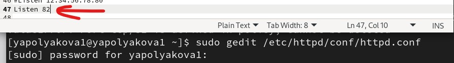{#fig-012 width=70%}

13. При перезапуске сервера происходит сбой ([рис. @fig-013]).

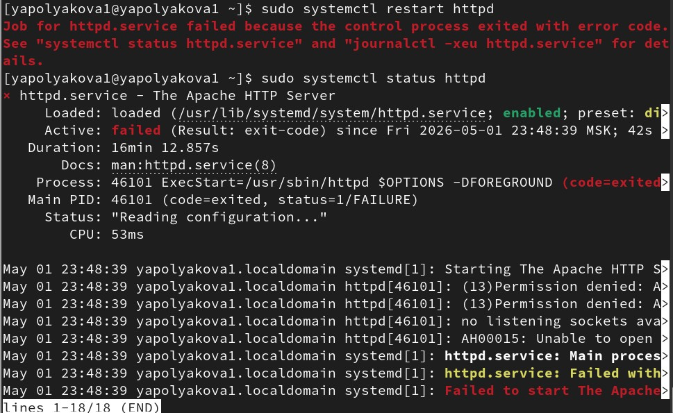{#fig-013 width=70%}

14. Анализируем log-файл. Видим, что SELinux ограничивает доступ сервера по порту 82. То есть сбой произошел из-за отсутствия доступа. ([рис. @fig-014]).

{#fig-014 width=70%}

15. В файле /var/log/http/error_log также видим ошибку, а вот в access_log как будто ничего не появилось нового, как и в /var/log/audit/audit.log. ([рис. @fig-015]).

{#fig-015 width=70%}

16. Добавляем порт 82 в группу с доступными портами командой sudo semanage port -a -t http_port_t -р tcp 82, проеряем sudo semanage port -l | grep http_port_t, перезапускаем сервер и видим, что он запустился. Это понятно, потому что теперь SELinux разрешает обращение сервера по этому порту 82. ([рис. @fig-016]).

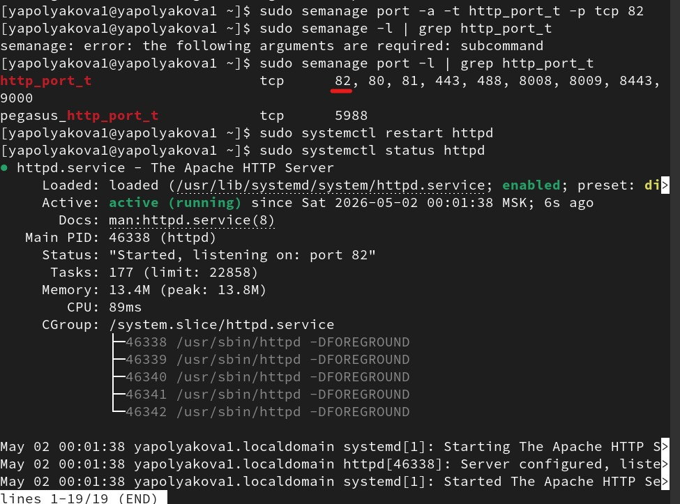{#fig-016 width=70%}

17. Возвращаем контекст httpd_sys_cоntent_t к файлу /var/www/html/ test.html: sudo chcon -t httpd_sys_content_t /var/www/html/test.html, теперь файл доступен через браузер. Возвращаем Listen 80 в конфигурационном файле. ([рис. @fig-017]).

{#fig-017 width=70%}

18. Удаляем привязку http_port_t к 82 порту: sudo semanage port -d -t http_port_t -p tcp 82 и проверяем, что порт 82 удалён. Удаляем файл /var/www/html/test.html: sudo rm /var/www/html/test.html ([рис. @fig-018]).

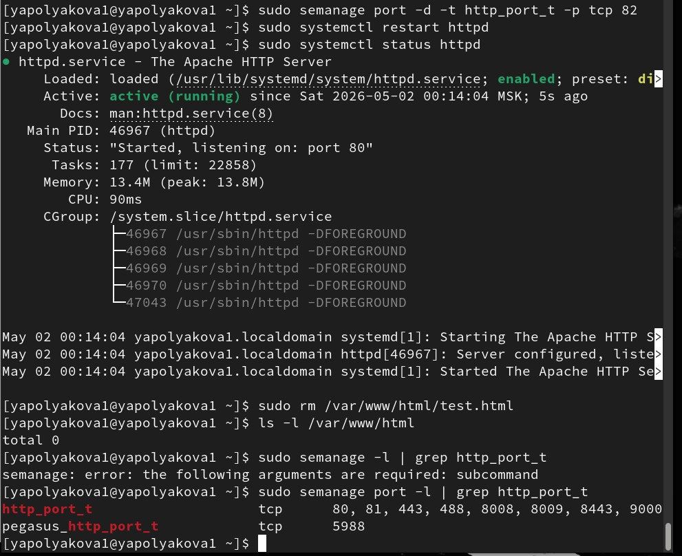{#fig-018 width=70%}

Более подробно про Unix см. в [@tanenbaum_book_modern-os_ru; @robbins_book_bash_en; @zarrelli_book_mastering-bash_en; @newham_book_learning-bash_en].

# Выводы

Мы развили навыки администрирования ОС Linux. Получили первое практическое знакомство с технологией SELinux.

Проверили работу SELinx на практике совместно с веб-сервером Apache.

# Список литературы{.unnumbered}

::: {#refs}
:::
