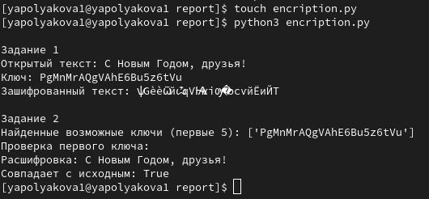

---
## Author
author:
  name: Полякова Юлия Александровна
  degrees: School
  orcid: 0009-0002-3294-7664
  email: 1132243102@rudn.ru
  affiliation:
    - name: Российский университет дружбы народов
      country: Российская Федерация
      postal-code: 117198
      city: Москва
      address: ул. Миклухо-Маклая, д. 6
## Title
title: Лабораторная работа №7
subtitle: Элементы криптографии. Однократное гаммирование
license: CC BY
date: today
date-format: "YYYY-MM-DD" # Example: 2025-09-06
---

# Информация

## Докладчик

:::::::::::::: {.columns align=center}
::: {.column width="70%"}

  * Полякова Юлия Александровна
  * студент
  * группа: НКАбд-04-24
  * Российский университет дружбы народов им. П. Лумумбы
  * [1132243102@rudn.ru](mailto:1132243102@rudn.ru)
  * <https://juliamaffin123.github.io/>

:::
::: {.column width="30%"}


:::
::::::::::::::

# Вводная часть

## Актуальность

- Изучение простых, но надежных алгоритмов таких как однократное гаммирование, является основой курса основ информационной безопасности

## Объект и предмет исследования

- Однократное гаммирование

## Цели и задачи

Освоить на практике применение режима однократного гаммирования.

Задача:

- Разработать приложение, позволяющее шифровать и дешифровать данные в режиме однократного гаммирования.

## Материалы и методы

- Консоль
- python3
- Однократное гаммирование

# Выполнение работы

## Программа 1

Генерирует случайный ключ такой же длины, как и текст. Состоит из случайных букв и цифр:

```python
def generate_key_hex(text):
	key = ''
	for i in range(len(text)):
		key += random.choice(string.ascii_letters + string.digits)
	return key
```

## Программа 2

Шифрование и дешифрование методом XOR. Возвращает результат XOR между каждым символом text и соответствующим символом key:

```python
def en_and_de_cript(text, key):
	res = ''
	for i in range(len(text)):
		res += chr(ord(text[i]) ^ ord(key[i % len(key)]))
	return res
```

## Программа 3

Находит возможные ключи, которые превращают часть шифротекста:

```python
def find_possible_keys(text, fragment):
	possible_keys = []
	for i in range(len(text)-len(fragment)+1):
		poss_key = ''
		for j in range(len(fragment)):
			poss_key += chr(ord(text[i+j]) ^ ord(fragment[j]))
		possible_keys.append(poss_key)
	return possible_keys
```

## Программа 4

Проверки:

print("\\nЗадание 1")

open_text = "С Новым Годом, друзья!"

key = generate_key_hex(open_text)

ciphertext = en_and_de_cript(open_text, key)

print("Открытый текст:", open_text)

print("Ключ:", key)

print("Зашифрованный текст:", ciphertext)


print("\\nЗадание 2")

found_keys = find_possible_keys(ciphertext, open_text)

print("Найденные возможные ключи (первые 5):", found_keys\[:5\])

print("Проверка первого ключа:")

decripted = en_and_de_cript(ciphertext, found_keys\[0\])

print("Расшифровка:", decripted)

print("Совпадает с исходным:", decripted == open_text)

## Программа, вывод

{#fig-001 width=80%}

## Вывод

Мы освоили на практике применение режима однократного гаммирования.

## Контрольные вопросы

1. Поясните смысл однократного гаммирования.

Это шифрование, при котором каждый символ открытого текста складывается по модулю 2 (XOR) с соответствующим символом ключа (гаммы) одинаковой длины. Ключ используется только один раз.

## Контрольные вопросы

2. Перечислите недостатки однократного гаммирования.
    - Ключ должен быть длиной не меньше сообщения.
    - Ключ нужно передать получателю защищённо.
    - Ключ нельзя использовать повторно.
    - Требуется истинно случайный ключ.

## Контрольные вопросы

3. Перечислите преимущества однократного гаммирования.
    - Абсолютная криптостойкость (при выполнении условий Шеннона).
    - Шифрование и дешифрование одинаковы (XOR).
    - Нет вычислительной сложности.

## Контрольные вопросы

4. Почему длина открытого текста должна совпадать с длиной ключа?

Иначе часть текста останется незашифрованной или ключ придётся повторять, что нарушит абсолютную стойкость.

## Контрольные вопросы

5. Какая операция используется в режиме однократного гаммирования, назовите её особенности.

Используется XOR (сложение по модулю 2). Особенности: обратимость, отсутствие переноса разрядов, зависимость каждого бита только от соответствующих битов текста и ключа.

## Контрольные вопросы

6. Как по открытому тексту и ключу получить шифротекст?

Ci=Pi⊕KiCi​=Pi​⊕Ki​ (побитово или побайтово XOR).

## Контрольные вопросы

7. Как по открытому тексту и шифротексту получить ключ?

Ki=Ci⊕PiKi​=Ci​⊕Pi​.

## Контрольные вопросы

8. В чём заключаются необходимые и достаточные условия абсолютной стойкости шифра?
    - Полная случайность ключа.
    - Длина ключа равна длине текста.
    - Однократное использование ключа.
