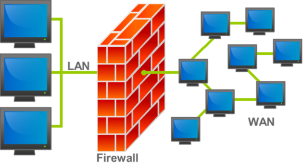
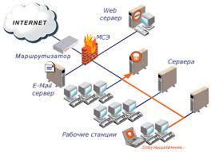

---
## Author
author:
  name: Полякова Юлия Александровна
  degrees: ---
  orcid: 0009-0002-3294-7664
  email: 1132243102@rudn.ru
  affiliation:
    - name: Российский университет дружбы народов
      country: Российская Федерация
      postal-code: 117198
      city: Москва
      address: ул. Миклухо-Маклая, д. 6

## Title
title: "Применение межсетевых экранов для защиты корпоративных сетей"
subtitle: "Доклад по основам информационной безопасности"
institute: "Российский университет дружбы народов"
date: today
date-format: "YYYY"
license: "CC BY"
---

# Цель работы

Цель данной работы - изучить понятие межсетевого экрана (МСЭ), их классификацию по уровням модели OSI, механизм работы, а также рассмотреть практические сценарии применения межсетевых экранов для защиты корпоративных сетей.

# Задание

Подготовить реферать по теме "Применение межсетевых экранов для защиты корпоративных сетей". В работе нужно:

1. Дать определение межсетевого экрана и описать его назначение.
2. Рассмотреть классификацию межсетевых экранов в соответствии с моделью OSI.
3. Описать дополнительные механизмы защиты (NAT, VPN, аутентификация).
4. Привести примеры использования межсетевых экранов в корпоративной среде.
5. Выделить преимущества и недостатки использования межсетевых экранов.

# Теоретическое введение

Межсетевой экран (МСЭ), также известен как брандмауэр или файервол (firewall), - это программное обеспечение, которое контролирует и фильтрует сетевой трафик в соответствии с заданными правилами, разделяя сеть на доверенные и недоверенные сегменты [@wikipedia_firewall]. Основная задача МСЭ - защита компьютерных сетей или отдельных узлов от несанкционированного доступа [@trendmicro_network_security]

Межсетевой экран позволяет реализовать политику безопасности организации в вопросах обмена информацией с внешним миром. Это значит, что администратор определяет, какой трафик является легальным (например, рабочая почта), а какой должен быть заблокирован.

Концепция межсетевых экранов появилась в конце 80-х годов 20 века. В историческом порядке выделяют три типа: пакетные фильтры, прокси прикладного уровня и МСЭ с контролем состояния.

На [рис. @fig-def] представлено схематическое изображение того, как межсетевой экран разделяет сети.

{#fig-def width=70%}

# Основная часть

## Назначение и функции межсетевого экрана

Главная задача межсетевого экрана - защита внутренней сети от несанкционированного доступа и предотвращение утечки информации наружу. Как показано на [рис. @fig-purpose], МСЭ располагается между интернетом и внутренними ресурсами комании (серверы UNIX, Windows NT, рабочие станции сотрудников).

{#fig-purpose width=70%}

Для выполнения этой задачи МСЭ реализует несколько механизмов защиты:

- **Фильтрация пакетов** - проверка заголовков проходящих пакетов.
- **Шифрование (VPN)** - создание защищенных каналов связи.
- **Трансляция адресов (NAT)** - сокрытие внутренних IP-адресов [@netcraze_firewall_guide].
- **Дополнительная аутентификация** - проверка подлинности пользователя.
- **Противодействие атакам** - защита от некоторых распространенных атак (DDoS, фишинг, переадресация маршрута) [@wikipedia_firewall].
- **Управление списками доступа** - настройка правил на маршрутизаторах.

## Типы межсетевых экранов

Наиболее полная классификация межсетевых экранов строится на основе уровней модели OSI [@intuit_firewall_classification_2003].

В [табл. @tbl-types] представлено сравнение типов МСЭ по уровням OSI.

| Тип межсетевого экрана | Уровень OSI | Принцип работы | Преимущества | Недостатки |
|------------------------|-------------|----------------|--------------|------------|
| **Пакетный фильтр** | Сетевой | Анализ заголовков IP-пакетов (IP-адреса, порты, протоколы). Решение для каждого пакета индивидуально. | Высокая скорость, простота | Не видит контекст сессии, уязвим к фрагментации |
| **Шлюз уровня соединения** | Сеансовый | Отслеживает состояние сессии, ведет таблицу соединений. Пропускает только пакеты, относящиеся к установленным сессиям. | Учитывает контекст, защищает от некоторых атак | Не анализирует содержимое пакетов |
| **Шлюз прикладного уровня** | Прикладной | Выступает посредником (прокси) между клиентом и сервером. Анализирует команды протоколов (HTTP, FTP, SMTP). | Максимальная безопасность, глубокий анализ | Низкая производительность, требует настройки для каждого протокола |
| **МСЭ с контролем состояния** | 3-7 | Комбинация подходов, прозрачное понимание сессии на разных уровнях. | Гибкость, понимание контекста | Сложность реализации |

: Сравнительная характеристика типов межсетевых экранов {#tbl-types}

### Пакетные фильтры

Пакетные фильтры - самый простой тип МСЭ. Они анализируют заголовки IP-пакетов и принимают решение на основе статических правил. Например, `ipfwadm` в ранних версиях Linux, `iptables`.

Пример команды:

```
iptables -A INPUT -i eth0 -p icmp --icmp-type echo-request -j ACCEPT
```

### Шлюзы уровня соединения

Шлюз сеансового (соединительного) уровня - это межсетевой экран устанавливающий отдельные TCP/UDP-соединения между внутренним и внешним узлом, проверяя подлинность сессии, но не анализируя содержимое пакетов. Обеспечивает безопасное посредничество (проксирование).

### Шлюзы прикладного уровня

Шлюз прикладного уровня (Application Layer Gateway, ALG) - это компонент NAT-маршрутизатора, который анализирует и модифицирует трафик прикладных протоколов (SIP, FTP, HTTP) для их корректной работы через брандмауэры. ALG позволяет устройствам внутри сети использовать динамические порты, делая их доступными для внешних пользователей Примеры: `squid`, `mod_security`, `fwtk`.

Пример команды:

```
http-gw: permit-hosts: 192.168.*.*
```

### МСЭ с контролем состояния

МСЭ с контролем состояния обеспечивают прозрачное «понимание» сессии на транспортном или прикладном уровне. Решение можно принимать на любом уровне, но необходима прозрачная реализация прикладных протоколов.

## Применение в корпоративных сетях

Рассмотрим три основных случая использования межсетевых экранов в компаниях.

### 1. Защита периметра сети

Это самый распространенный пример. На границе между локальной сетью компании и интернетом устанавливается аапаратный или программный межсетевой экран. Он выполняет роль "входных ворот":

- Закрывает все порты, кроме необходимых для работы (например, 80 для веб-трафика, 25 для почты)
- Использует NAT, чтобы сткрыть внутренние IP-адреса от внешнего мира [@netcraze_firewall_guide]
- Ведет логи (отчет) всех попыток подключения

### 2. Организация удаленного доступа (VPN)

В современных компаниях набирает популярность формат удаленной работы. Межсетевой экран позволяет организовать безопасный доступ к внутренним ресурсам через интернет [@netcraze_firewall_guide]:

1. Сотрудник подключается к VPN-серверу, который часто является частью МСЭ.
2. Проходит аутентификацию (пароль, сертификат доступа).
3. Между ним и офисом устанавливается шифрованное соединение (безопасный туннель).
4. Весь трафик внутри туннеля защищен от прослушивания.

### 3. Сегментирование внутренней сети

Внутри компании может потребоваться дать некоторым сотрудникам доступ к определенным ресурсам, при этом у других не должно быть этого доступа. С помощью межсетевых экранов (или правил на управляемых коммутаторах) сеть делят на сегменты, например:

- Бухгралтерия - доступ к финансовым системам (1С, банк-клиент)
- Отдел разработки - доступ к репозиторям кода, серверам сборки
- Общий отдел - доступ к принтерам, серверам с файлами
- Гостевая сеть - только интернет, изоляция от внутренних ресурсов

Если злоумышленник проникнет через гостевую сеть или компьютер в одном отделе, сегментирование не даст ему сразу переместиться в другие критически важные сегменты.

## Плюсы и минусы использования межсетевых экранов

Как и у любого средства защиты, у межсетевых экранов есть свои преимущества и недостатки.

**Достоинства:**

- Обеспечивают базовый уровень защиты сети - без него работа в интернете небезопасна
- Позволяют централизованно управлять политиками доступа
- Ведут журналы событий, что полезно для расследования инцидентов
- Могут повысить производительность, блокируя нежелательный трафик
- Защищают от массовых атак (сканирование портов, простые DoS)

**Недостатки:**

- Не являются панацеей - не защищают от вирусов во вложениях почты, от атак через легальные учетные записи [@trendmicro_network_security]
- Сложность настройки - ошибка в правиле может либо открыть брешь, либо полностью парализовать работу
- Снижение производительности - каждый пакет проверяется, это требует времени
- Сам может стать объектом атаки - уязвимости в МСЭ открывают дорогу злоумышленникам
- Требует регулярного обслуживания

# Выводы

В результате выполнения работы были сделаны следующие выводы:

1. Межсетевой экран является **базовым и обязательным элементом защиты** любой корпоративной сети, реализующим политику безопасности компании и контролирующим трафик на границе доверенных и недоверенных сегментов [@wikipedia_firewall].

2. Типы межсетевых экранов различаются по уровню фильтрации в модели OSI [@intuit_firewall_classification_2003]:

   - Пакетные фильтры работают на сетевом уровне
   - Шлюзы уровня соединения - на сеансовом уровне
   - Шлюзы прикладного уровня - на прикладном уровне
   - МСЭ с контролем состояния комбинируют подходы

3. На практике МСЭ применяются для трех основных задач:

   - Защита периметра сети
   - Организация защищённых удалённых подключений (VPN)
   - Сегментирование внутренней сети для разграничения доступа

4. Использование межсетевых экранов имеет как преимущества (контроль трафика, логирование), так и недостатки (сложность настройки, не защищает от всех угроз), которые необходимо учитывать при проектировании системы информационной безопасности.

# Список литературы{.unnumbered}

::: {#refs}
:::
