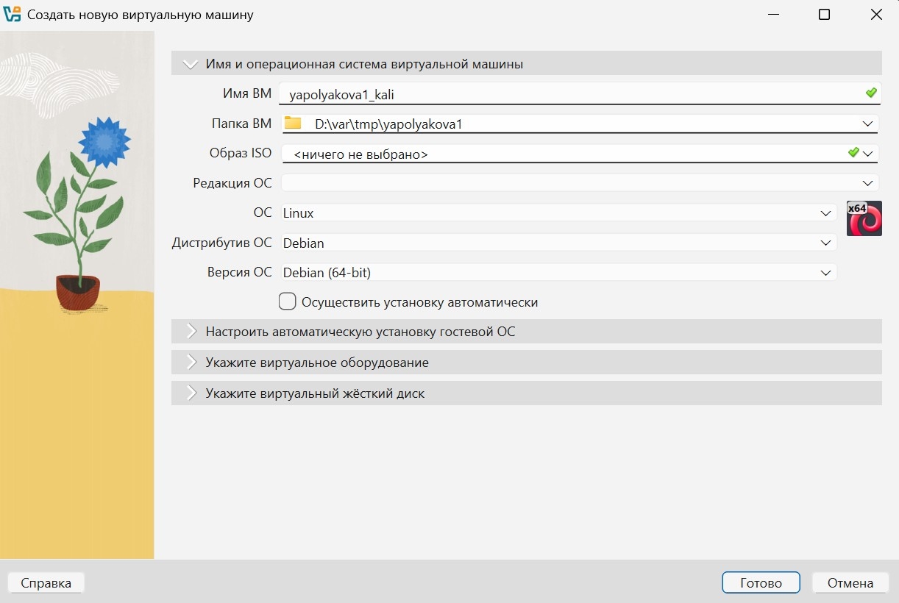
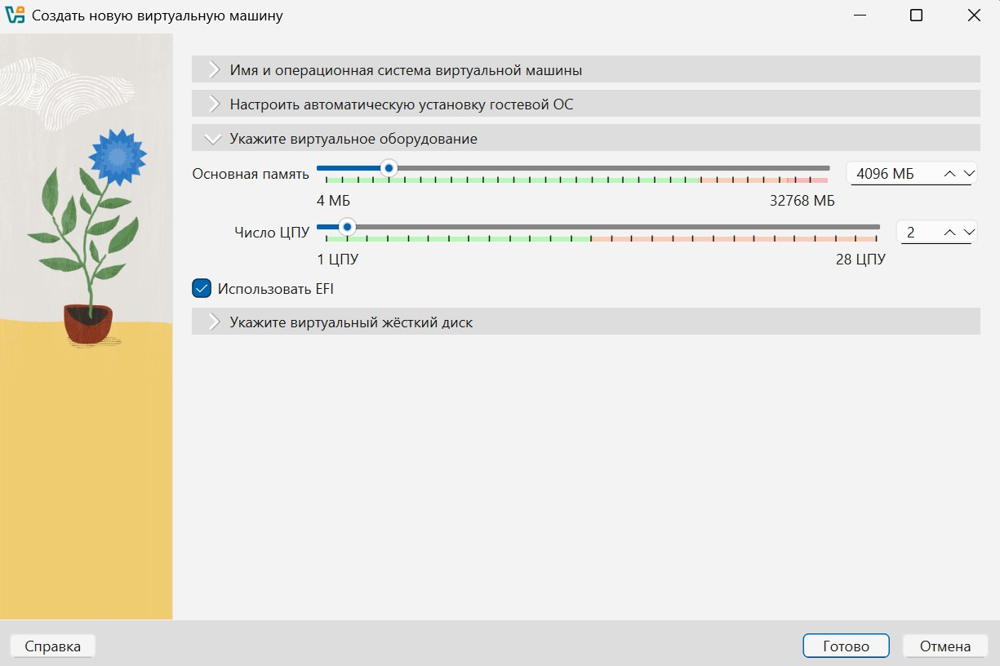
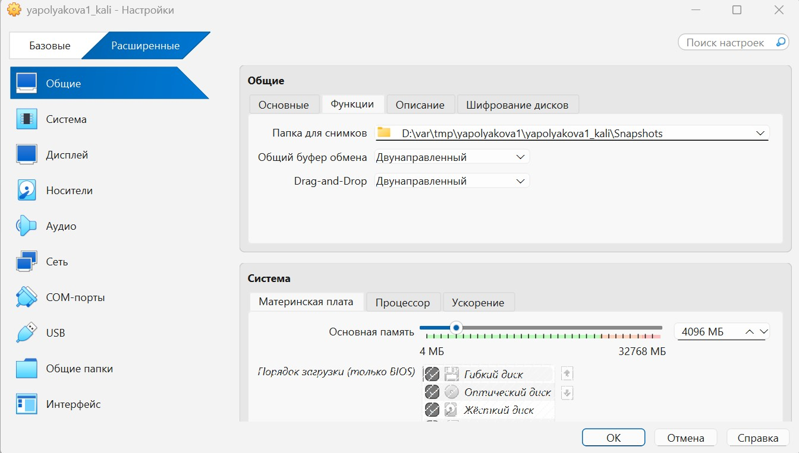
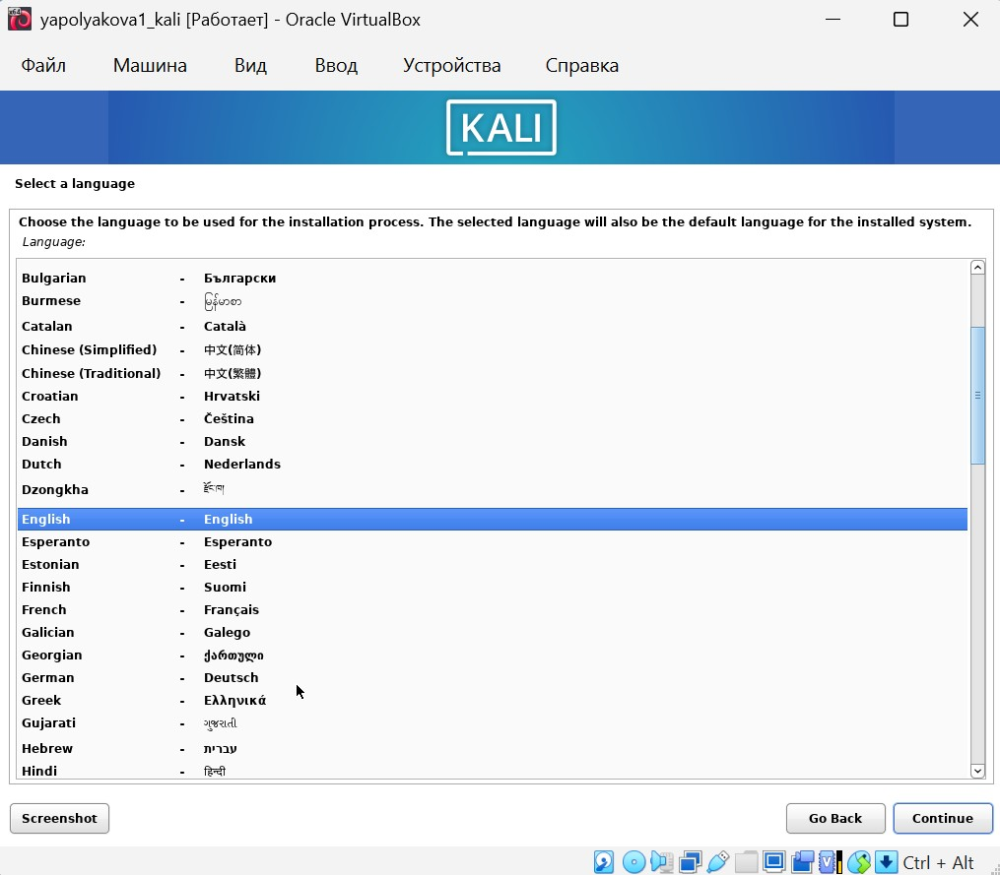
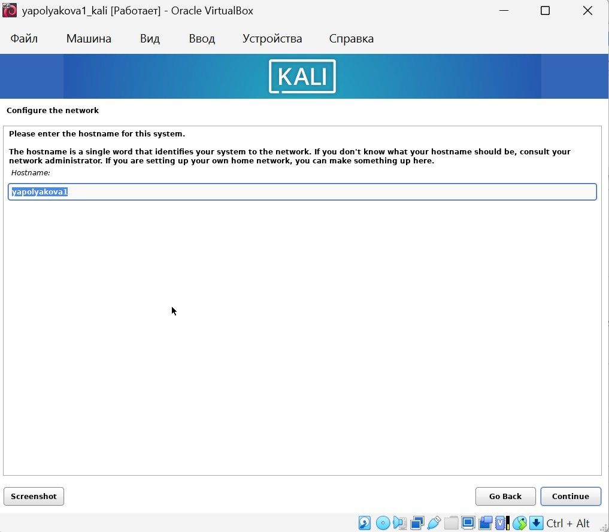
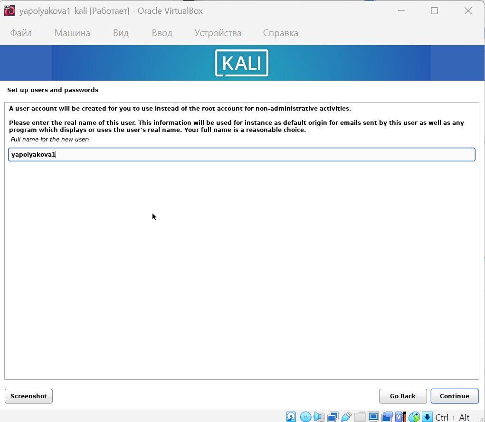
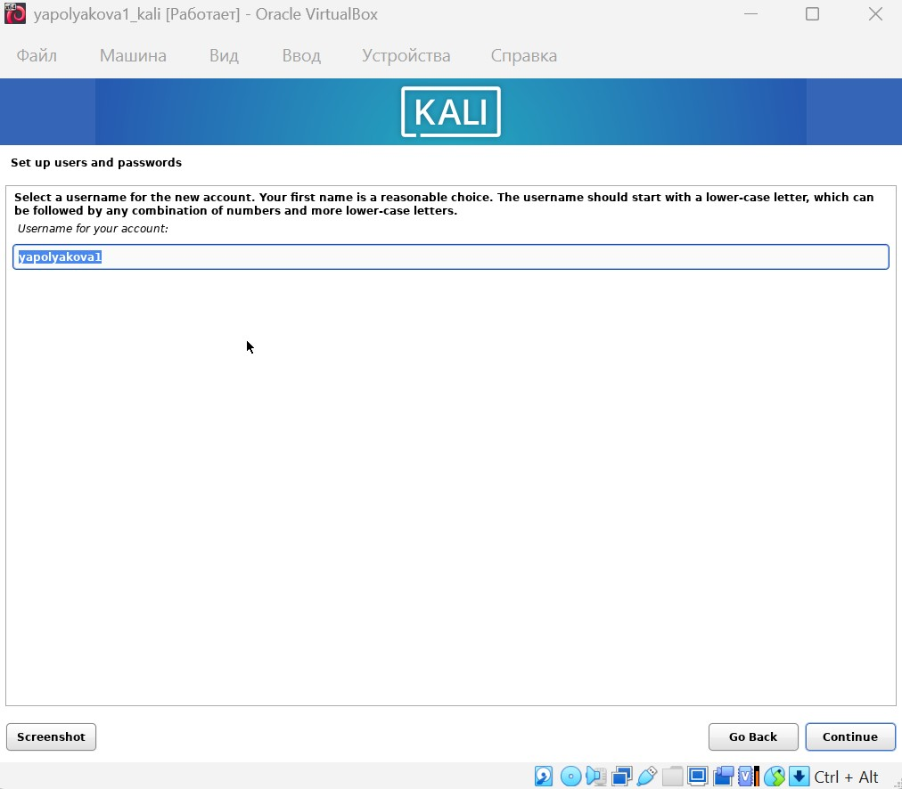
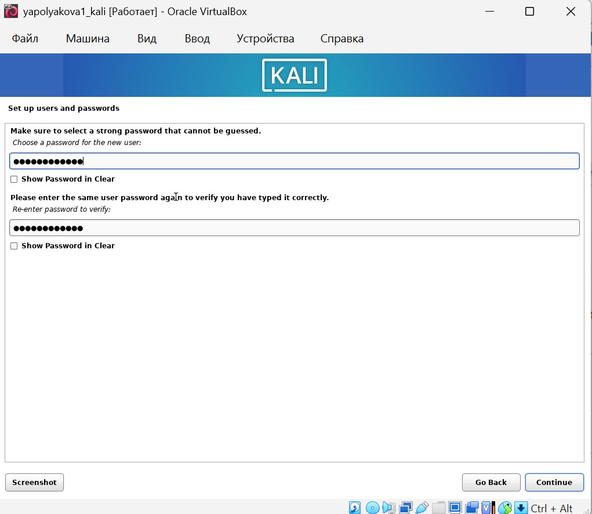
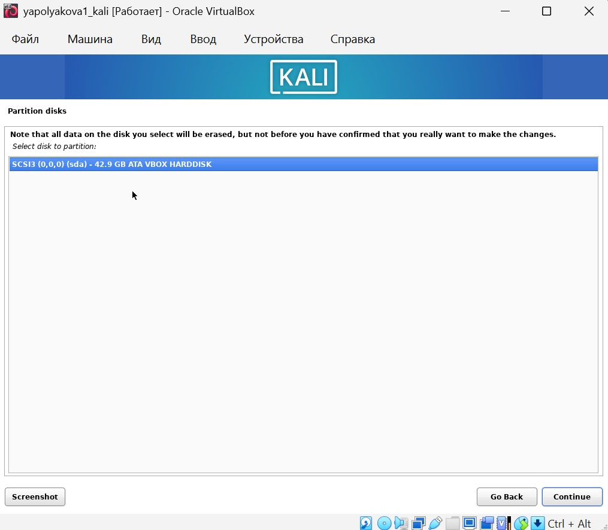
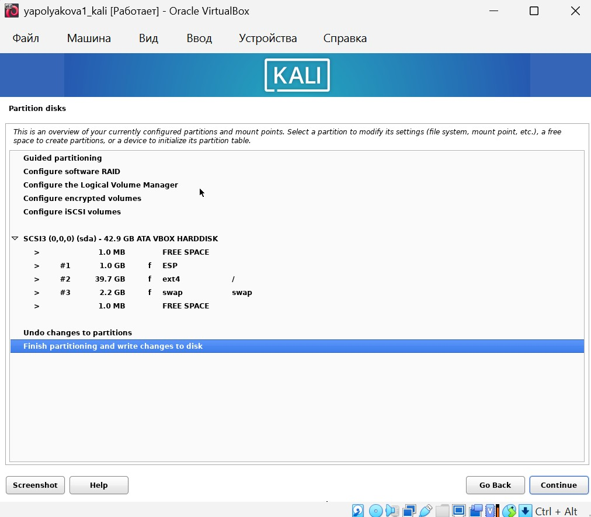

---
## Author
author:
  name: Полякова Юлия Александровна
  degrees: School
  orcid: 0009-0002-3294-7664
  email: 1132243102@rudn.ru
  affiliation:
    - name: Российский университет дружбы народов
      country: Российская Федерация
      postal-code: 117198
      city: Москва
      address: ул. Миклухо-Маклая, д. 6

## Title
title: "Индивидуальный проект"
subtitle: "Этап №1"
license: "CC BY"
---

# Цель работы

Целью данной работы является установка дистрибутива Kali Linux в виртуальную машину.

# Выполнение этапа проекта

1. Создаем новую виртуальную машину (Машина - Создать). Выбираем имя (соответствующее соглашению), тип и версию для виртуальной машины. ([рис. @fig-001])

{#fig-001 width=65%}

2. Задаем размер основной памяти ОЗУ 4096 МБ, кратное 1024 МБ, а также кол-во процессоров. Для корректной работы также включим EFI. ([рис. @fig-002])

{#fig-002 width=65%}

3. Устанавливаем размер жесткого диска 40 ГБ. ([рис. @fig-003])

{#fig-003 width=65%}

4. Переходим в Настройки - Носители, выбираем ранее загруженный с официального сайта оптический диск. ([рис. @fig-004])

{#fig-004 width=65%}

5. Переходим в Настройки - Общие - Функции, добавляем двунаправленный общий буфер и обмена и возможность делать Drag-and-Drop ([рис. @fig-005])

{#fig-005 width=65%}

6. Выбираем English в качестве языка интерфейса. ([рис. @fig-006]).

{#fig-006 width=65%}

7. Выбираем текущую локацию ([рис. @fig-007])

{#fig-007 width=65%}

8. Так как такой комбинации языка и локации нет, то выбираем предложенный вариант. ([рис. @fig-008])

{#fig-008 width=65%}

9. Добавляем язык клавиатуры. ([рис. @fig-009])

{#fig-009 width=65%}

10. Добавляем имя хоста системы в соответствии с соглашением об именовании. ([рис. @fig-010]).

{#fig-010 width=65%}

11. Добавляем доменное имя. ([рис. @fig-011])

{#fig-011 width=65%}

12. Задаем имя пользователя в соответствии с соглашением об именовании (это полное имяя пользователя). ([рис. @fig-012]).

{#fig-012 width=65%}

13. Задаем имя пользователя. ([рис. @fig-013])

{#fig-013 width=65%}

14. Задаем пароль пользователя. ([рис. @fig-014])

{#fig-014 width=65%}

15. Задаем часовой пояс. ([рис. @fig-015])

{#fig-015 width=65%}

16. Выбираем тип разметки диска. ([рис. @fig-016])

{#fig-016 width=65%}

17. Выбираем предложенный диск. ([рис. @fig-017])

{#fig-017 width=65%}

18. Задаем структуру каталогов, выбираем рекомендованный вариант. ([рис. @fig-018])

{#fig-018 width=65%}

19. Проверяем и подтверждаем все изменения. ([рис. @fig-019])

{#fig-019 width=65%}

20. Окончательно подтвержаем изменения, выбираем Yes. ([рис. @fig-020])

{#fig-020 width=65%}

21. Оставляем все предложенные инструменты. ([рис. @fig-021])

{#fig-021 width=65%}

22. После завершения загрузки корректно перезапускаем систему, нажав на Continue. ([рис. @fig-022])

{#fig-022 width=65%}

23. После перезапуска проверяем порт оптического диска. Если он там есть, то выключаем машину и извлекаем его. Теперь система готова к работе. ([рис. @fig-023])

{#fig-023 width=65%}

# Выводы

Удачно развернут и настроен Kali Linux на VirtualBox

