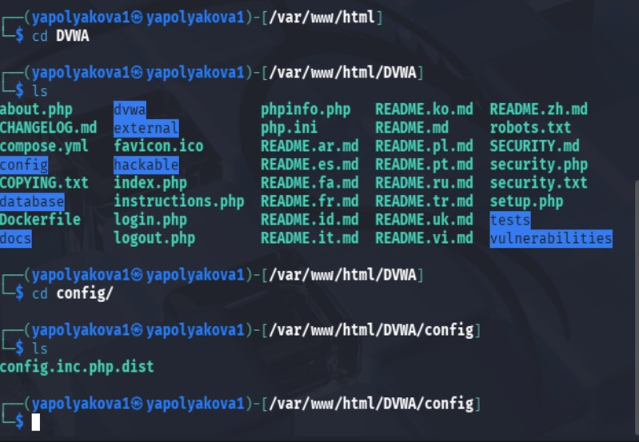
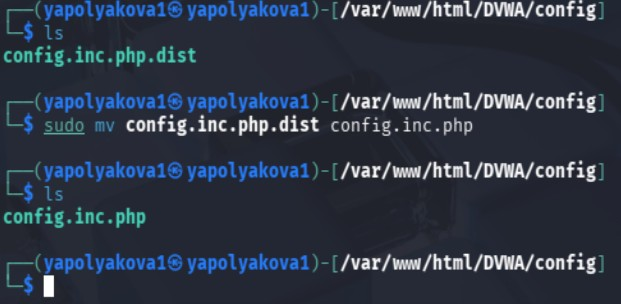
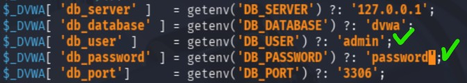
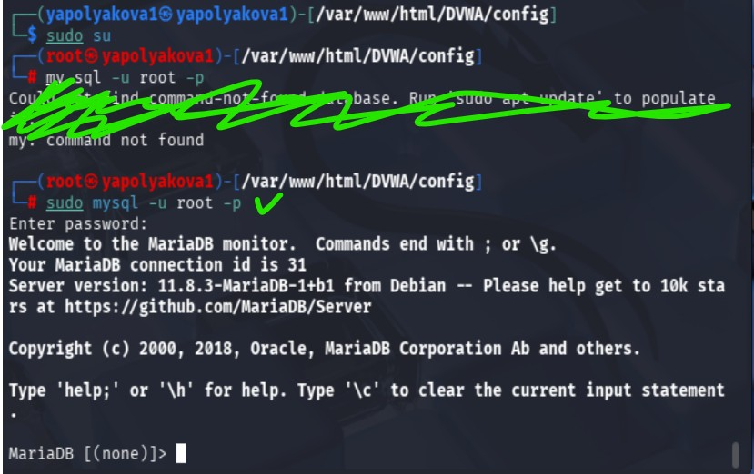
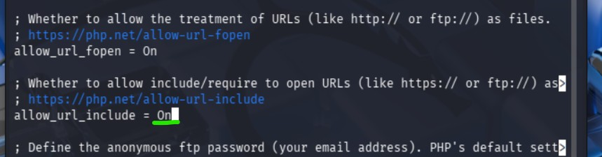
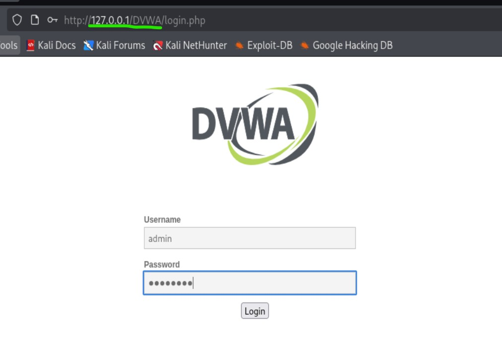
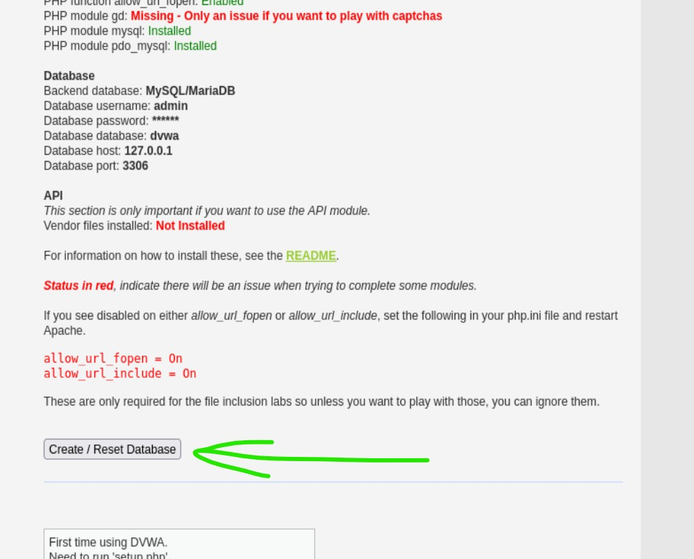
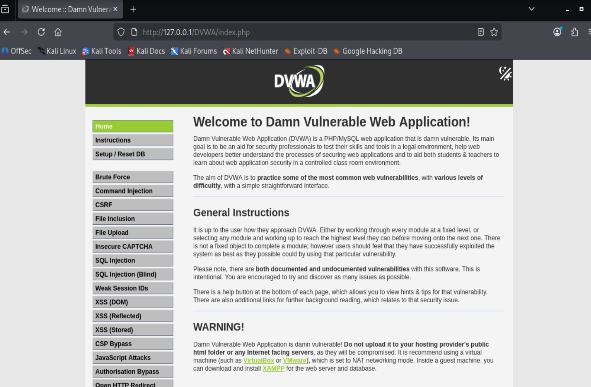

---
## Author
author:
  name: Полякова Юлия Александровна
  degrees: ---
  orcid: 0009-0002-3294-7664
  email: 1132243102@rudn.ru
  affiliation:
    - name: Российский университет дружбы народов
      country: Российская Федерация
      postal-code: 117198
      city: Москва
      address: ул. Миклухо-Маклая, д. 6
## Title
title: Индивидуальный проект
subtitle: Этап №2
license: CC BY
date: today
date-format: "YYYY-MM-DD" # Example: 2025-09-06
---

# Информация

## Докладчик

:::::::::::::: {.columns align=center}
::: {.column width="70%"}

  * Полякова Юлия Александровна
  * студент
  * группа: НКАбд-04-24
  * Российский университет дружбы народов им. П. Лумумбы
  * [1132243102@rudn.ru](mailto:1132243102@rudn.ru)
  * <https://juliamaffin123.github.io/>

:::
::: {.column width="30%"}

:::
::::::::::::::

# Вводная часть

## Актуальность

- Установка серверного приложения в Kail Linux довольно полезный навык
- Установка DVWA - позволит перейти к практике обучения основам информационной безопасности

## Объект и предмет исследования

- Kail Linux
- VirtualBox
- DVWA (Damn Vulnerable Web Application)

## Цели и задачи

Установить DVWA в гостевую систему к Kali Linux.

Задачи:

- Клонировать репозиторий с DVWA
- Запустить это приложение на веб-сервере

## Материалы и методы

- Средство для развертывания в.м. VirtualBox
- Kali Linux
- Репозиторий https://github.com/digininja/DVWA.git
- quarto для создания презентаций и отчетов из Markdown

# Выполнение работы

## Скачиваем DVWA

{#fig-001 width=60%}

## Даем доступ папке

{#fig-002 width=60%}

## Ищем файл конфигурации

{#fig-003 width=60%}

## Переименовываем файл

{#fig-004 width=65%}

## Изменяем файл конфигурации

{#fig-005 width=65%}

## Стартуем сервер

{#fig-006 width=50%}

## Авторизуемся в MySQL

{#fig-007 width=60%}

## Создаем БД

{#fig-008 width=65%}

## Правим конфигурацию сервера

{#fig-009 width=45%}

## Меняем параметры сервера

{#fig-010 width=65%}

## Стартуем сервер apache2

{#fig-011 width=50%}

## Стартуем DVWA

{#fig-012 width=60%}

## Создаем базу

{#fig-013 width=45%}

## Главная страница DVWA

{#fig-014 width=45%}

# Выводы

## Результат

Установлено небезопасное учебное приложение DVWA в гостевую систему к Kali Linux.

