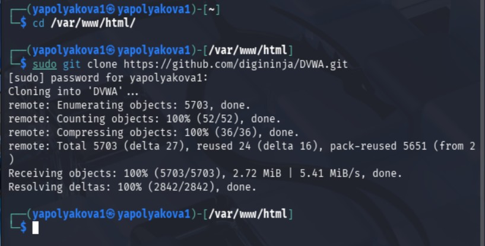
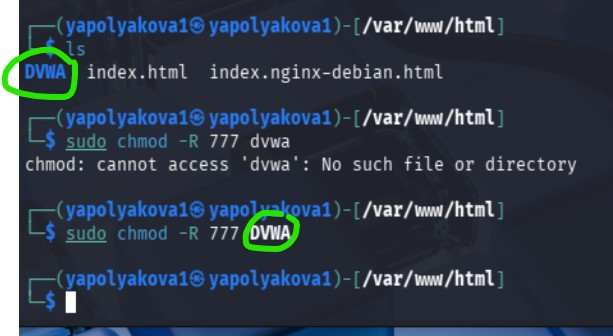
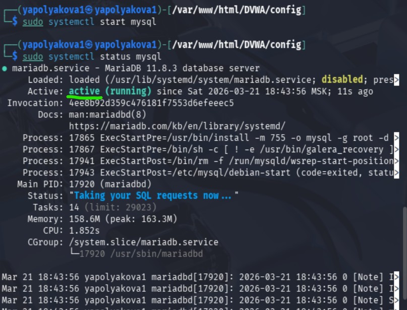
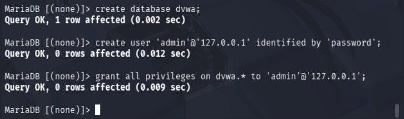
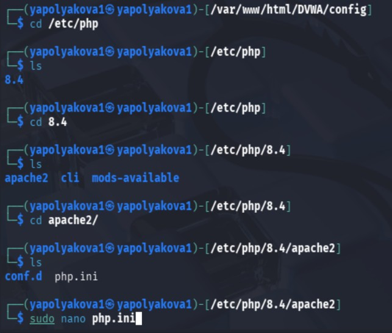
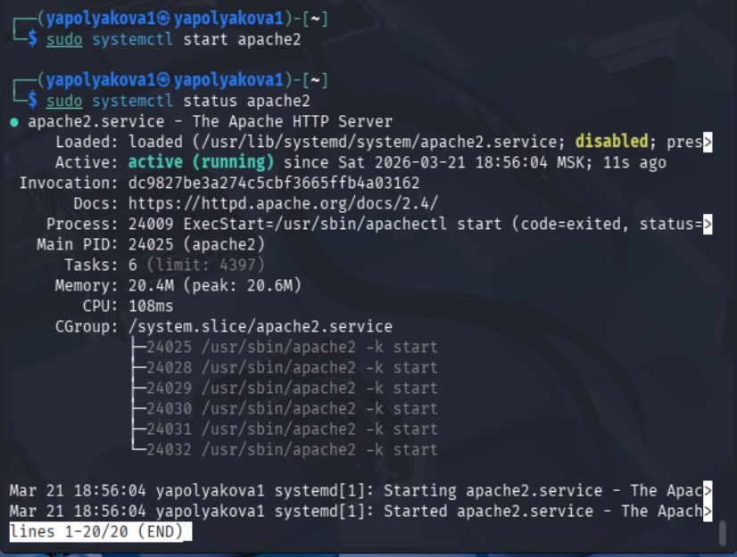

---
## Author
author:
  name: Полякова Юлия Александровна
  degrees: ---
  orcid: 0009-0002-3294-7664
  email: 1132243102@rudn.ru
  affiliation:
    - name: Российский университет дружбы народов
      country: Российская Федерация
      postal-code: 117198
      city: Москва
      address: ул. Миклухо-Маклая, д. 6

## Title
title: "Индивидуальный проект"
subtitle: "Этап №2"
license: "CC BY"
---

# Цель работы

Установить DVWA в гостевую систему к Kali Linux.

# Выполнение этапа проекта

Все установлено поэтапно с помощью ресурса - [@geeksforgeeks]

1. Скачиваем DVWA из репозитория. Переходим в нужную папку командой **cd var/www/html/**. Затем под учетной записью администратора клонируем репозиторий из Git: **sudo git clone https://github.com/digininja/DVWA.git**([рис. @fig-001])

{#fig-001 width=65%}

2. Даем доступ папке DVWA командой **sudo chmod -R 777 DVWA** ([рис. @fig-002])

{#fig-002 width=65%}

3. Переходим в папку **cd DVWA**, затем **cd config/**, там должен находится файл **config.inc.php.dist** ([рис. @fig-003])

{#fig-003 width=65%}

4. Переименовываем файл командой **sudo mv config.inc.php.dist config.inc.php**, должно получиться **config.inc.php** ([рис. @fig-004])

{#fig-004 width=65%}

5. Изменяем файл в редакторе nano командой **sudo nano config.inc.php**. Устанавливаем db_user = admin и db_password = password ([рис. @fig-005])

{#fig-005 width=65%}

6. Стартуем сервер базы данных командой **sudo systemctl start mysql** и проверяем его статус **sudo systemctl status mysql**, он должен быть **active (running)** ([рис. @fig-006]).

{#fig-006 width=65%}

7. Переходим в root командой **sudo su** и логинимся в MySQL, используя команду **sudo mysql -u root -ps** ([рис. @fig-007])

{#fig-007 width=65%}

8. Создаем базу данных тремя командами: 1) **create database dvwa;**; 2) **create user 'admin'@'127.0.0.1' identified by 'password';**; 3) **grant all privileges on dvwa.* to 'admin'@'127.0.0.1';** ([рис. @fig-008])

{#fig-008 width=65%}

9. Ищем папку с конфигурационным файлом веб-сервера apache2. С помощью редактора nano изменяем файл **php.ini** ([рис. @fig-009])

{#fig-009 width=65%}

10. Проверяем, что параметры **allow_url_fopen** и **allow_url_include** оба имеют значение **On** ([рис. @fig-010]).

{#fig-010 width=65%}

11. Стартуем сервер apache2 командой **sudo systemctl start apache2**, проверяем статус командой **sudo systemctl status apache2** ([рис. @fig-011])

{#fig-011 width=65%}

12. В браузере вводим **127.0.0.1/DVWA**, автоматически перенесет на страницу с авторизацией. Вводим имя пользователя и пароль, который задали ранее ([рис. @fig-012]).

{#fig-012 width=65%}

13. В самом низу страницы нажимаем кнопку **Create / Reset Database** и заново логинимся ([рис. @fig-013])

{#fig-013 width=65%}

14. Наше небезопасное приложение готово к тестированию ([рис. @fig-014])

{#fig-014 width=65%}

# Выводы

Установлено небезопасное учебное приложение DVWA в гостевую систему к Kali Linux.

# Список литературы{.unnumbered}

::: {#refs}
:::

