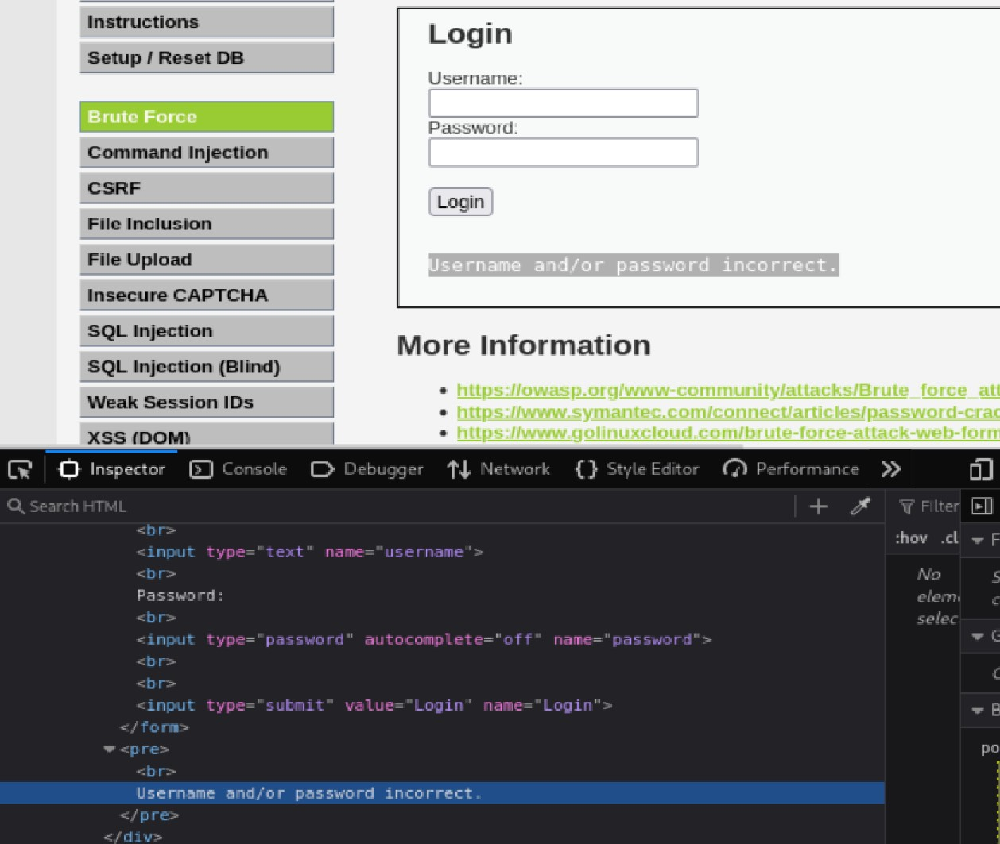
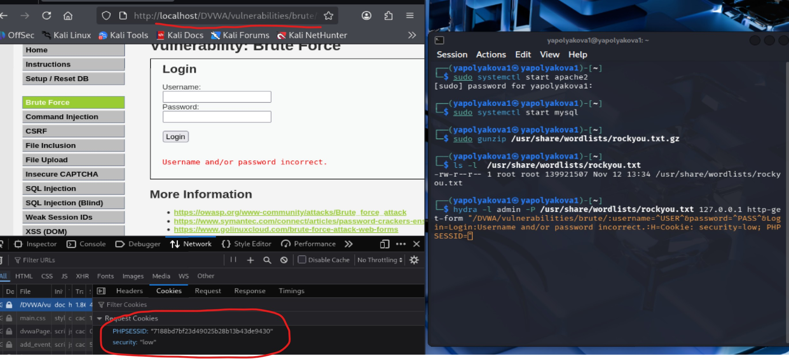

---
## Author
author:
  name: Полякова Юлия Александровна
  degrees: ---
  orcid: 0009-0002-3294-7664
  email: 1132243102@rudn.ru
  affiliation:
    - name: Российский университет дружбы народов
      country: Российская Федерация
      postal-code: 117198
      city: Москва
      address: ул. Миклухо-Маклая, д. 6
## Title
title: Индивидуальный проект
subtitle: Этап №3
license: CC BY
date: today
date-format: "YYYY-MM-DD" # Example: 2025-09-06
---

# Информация

## Докладчик

:::::::::::::: {.columns align=center}
::: {.column width="70%"}

  * Полякова Юлия Александровна
  * студент
  * группа: НКАбд-04-24
  * Российский университет дружбы народов им. П. Лумумбы
  * [1132243102@rudn.ru](mailto:1132243102@rudn.ru)
  * <https://juliamaffin123.github.io/>

:::
::: {.column width="30%"}

:::
::::::::::::::

# Вводная часть

## Актуальность

- Изучение hydra позволит больше понять, какие механизмы защиты нужны для веб-приложений

## Объект и предмет исследования

- Hydra

- DVWA (Damn Vulnerable Web Application)
- DVWA Brute Force

## Цели и задачи

Выполнить атаку с помощью hydra на веб-приложение DVWA.

Задачи:

- Запутсить DVWA
- Узнать пароль пользователя по его логину с помощью Hydra

## Материалы и методы

- Средство для развертывания в.м. VirtualBox
- Kali Linux
- Hydra
- DVWA

# Выполнение работы

## Запуск и подготовка DVWA

Запускаем DVWA. Переходим по **http://localhost/DVWA**. Ставим уровень безопасности low. Переходим на страницу Brute Force.

{#fig-001 width=50%}

## Получаем сообшение об ошибке в форме

Находим в разметке страницы форму, вводим заведомо неверные данные и получаем сообщение об ошибке, которое будем использовать для hydra.

{#fig-002 width=35%}

## Получаем список паролей

Получаем список известных паролей rockyou.txt

{#fig-003 width=50%}

## Информация из Cookie

Из Cookies берем информацию о защите и информация айди сессии. Также нужен url страницы и IP-адрес, у нас localhost.

{#fig-004 width=50%}

## Команда hydra

Завершаем команду **hydra -l admin** (имя пользователя, для которого подбираем пароль) **-P** (путь до списка паролей) (IP-адрес) (тип атаки, здесь атака на get-форму) "(ссылка:Имя_пользователя,пароль,логин:Информация_из_куки:Сообщение_ошибки)". Результом становится 1 пароль для нашего пользователя admin.

{#fig-005 width=35%}

## Проверка пароля

{#fig-006 width=55%}

# Выводы

## Результат

Успешно применили hydra и узнали пароль пользователя admin в веб-приложении DVWA.
