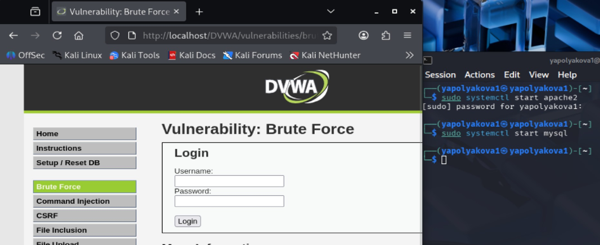
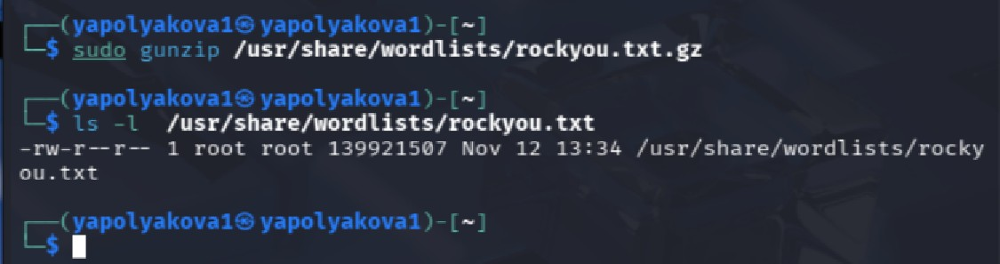
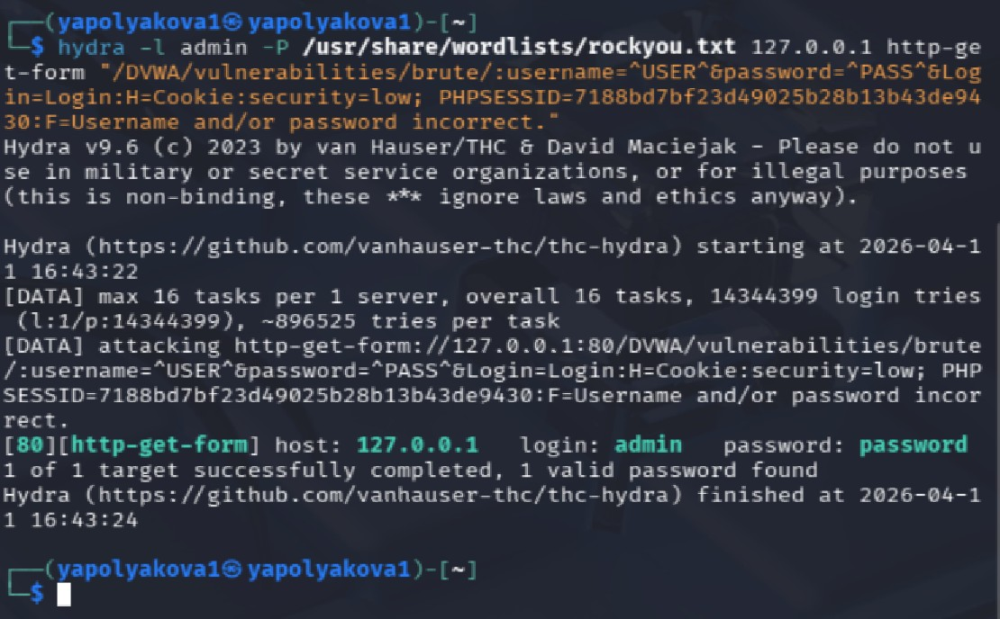
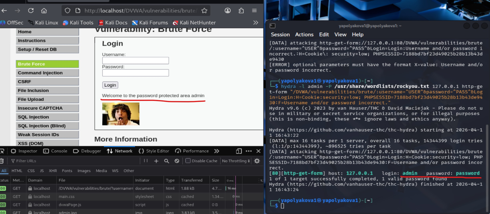

---
## Author
author:
  name: Полякова Юлия Александровна
  degrees: ---
  orcid: 0009-0002-3294-7664
  email: 1132243102@rudn.ru
  affiliation:
    - name: Российский университет дружбы народов
      country: Российская Федерация
      postal-code: 117198
      city: Москва
      address: ул. Миклухо-Маклая, д. 6

## Title
title: "Индивидуальный проект"
subtitle: "Этап №3"
license: "CC BY"
---

# Цель работы

Выполнить атаку с помощью hydra на веб-приложение DVWA (узнать пароль пользователя по его логину).

# Выполнение этапа проекта

Этап выполнен при помощи ресурса - [@blog]

1. Чтобы выполнить задание, нужно проверить, что веб-приложение и база данных запущены. Поэтому мы в терминале запускаем их командами, представленными на скрине справа. Затем в браузере переходим по ссылке **http://localhost/DVWA**. Потом логинимся и в настройках безопасности в меню слева внизу поставим уровень low, чтобы было проще показать работу hydra. Перейдем на страницу Brute Force, чтобы продемонстрировать работу hydra. ([рис. @fig-001])

{#fig-001 width=65%}

2. Правой кнопкой мыши кликаем на страницу, нажимаем "Посмотреть код" или "Inspect". Находим в разметке страницы форму, изучаем ее. Затем вводим заведомо неверные данные и получаем сообщение об ошибке (), которое будем использовать в команде для hydra. ([рис. @fig-002])

{#fig-002 width=65%}

3. Распаковываем встроенный в Kali архив со списком известных паролей в файле rockyou.txt командой gunzip от суперпользователя. Проверям, что файл распаковался. По этим паролям будет идти hydra, чтобы подобрать нужный. ([рис. @fig-003])

{#fig-003 width=65%}

4. Начинаем писать команду для hydra. Для последних аргументов нужен Cookie сессии. Мы обновляем страницу и находим его, нажав на brute в списке, а затем на Cookies. Оттуда нам потребуется и информация о защите, и информация о айди сессии, это добавим в команду. Таже для команды нам нужен url страницы, в которую отправим запрос и IP-адрес, у нас localhost. ([рис. @fig-004])

{#fig-004 width=65%}

5. Завершаем команду **hydra -l admin** (имя пользователя, для которого подбираем пароль) **-P** (путь до списка паролей) (IP-адрес) (тип атаки, здесь атака на get-форму) "(ссылка:Имя_пользователя,пароль,логин:Информация_из_куки:Сообщение_ошибки)". Результом становится 1 пароль для нашего пользователя admin. ([рис. @fig-005])

{#fig-005 width=65%}

6. Проверяем пароль, он действительно подходит. ([рис. @fig-006]).

{#fig-006 width=65%}

# Вывод

Успешно применили hydra и узнали пароль пользователя admin в веб-приложении DVWA.

# Список литературы{.unnumbered}

::: {#refs}
:::

