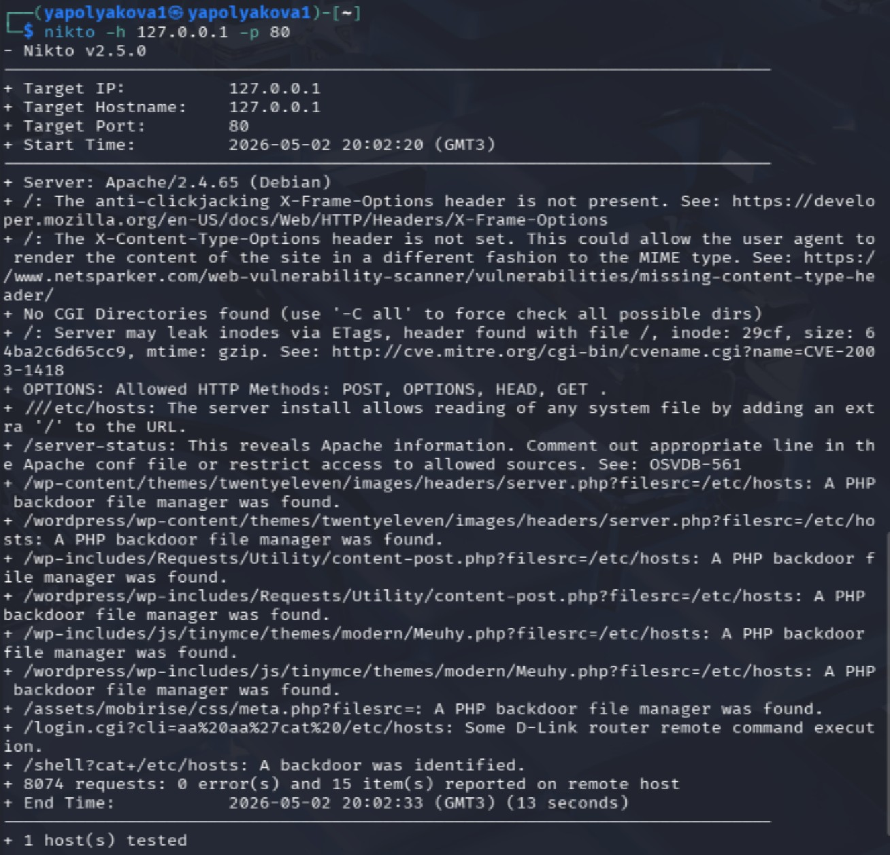
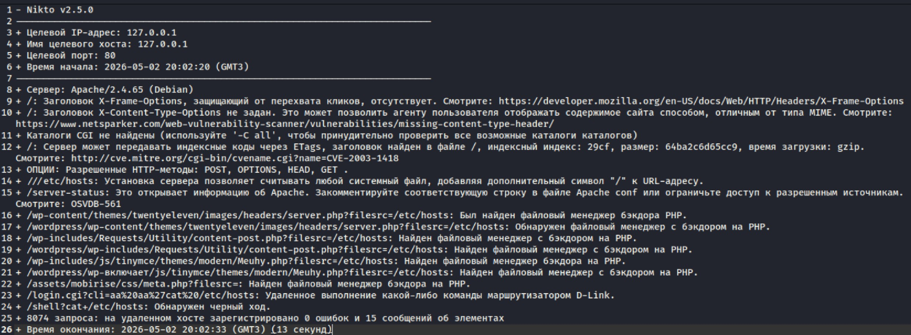

---
## Author
author:
  name: Полякова Юлия Александровна
  degrees: ---
  orcid: 0009-0002-3294-7664
  email: 1132243102@rudn.ru
  affiliation:
    - name: Российский университет дружбы народов
      country: Российская Федерация
      postal-code: 117198
      city: Москва
      address: ул. Миклухо-Маклая, д. 6
## Title
title: Индивидуальный проект
subtitle: Этап №4. Использование nikto
license: CC BY
date: today
date-format: "YYYY-MM-DD" # Example: 2025-09-06
---

# Информация

## Докладчик

:::::::::::::: {.columns align=center}
::: {.column width="70%"}

  * Полякова Юлия Александровна
  * студент
  * группа: НКАбд-04-24
  * Российский университет дружбы народов им. П. Лумумбы
  * [1132243102@rudn.ru](mailto:1132243102@rudn.ru)
  * <https://juliamaffin123.github.io/>

:::
::: {.column width="30%"}

:::
::::::::::::::

# Вводная часть

## Актуальность

- Изучение nikto позволит получить навык поиска уязвимостей веб-приложения.

## Объект и предмет исследования

- nikto

- DVWA (Damn Vulnerable Web Application)

## Цели и задачи

Просканировать веб-приложение DVWA на уязвимости с помощью сканера безопасности nikto.

Задачи:

- Запутсить DVWA
- Узнать уязвимости с помощью nikto

## Материалы и методы

- Средство для развертывания в.м. VirtualBox
- Kali Linux
- nikto
- DVWA

# Выполнение работы

## Запуск и подготовка DVWA

Запускаем DVWA. Переходим по **http://localhost/DVWA**. Ставим уровень безопасности low.

{#fig-001 width=50%}

## Запуск сканера 1

{#fig-002 width=50%}

## Запуск сканера 2

nikto -h цель -p порт, где цель - домен или IP-адрес целевого сайта, а порт - порт, на котором запущен сервис

{#fig-003 width=35%}

## Найденные уязвимости

{#fig-004 width=65%}

## Выводы

Были успешно установленны самые главные уязвимости веб-приложения DVWA с помощью сканера безопасности nikto.
