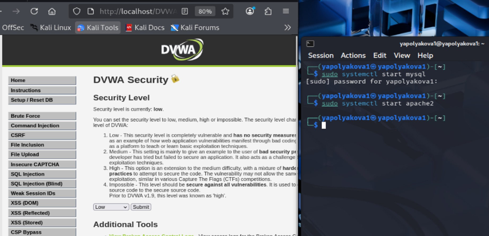
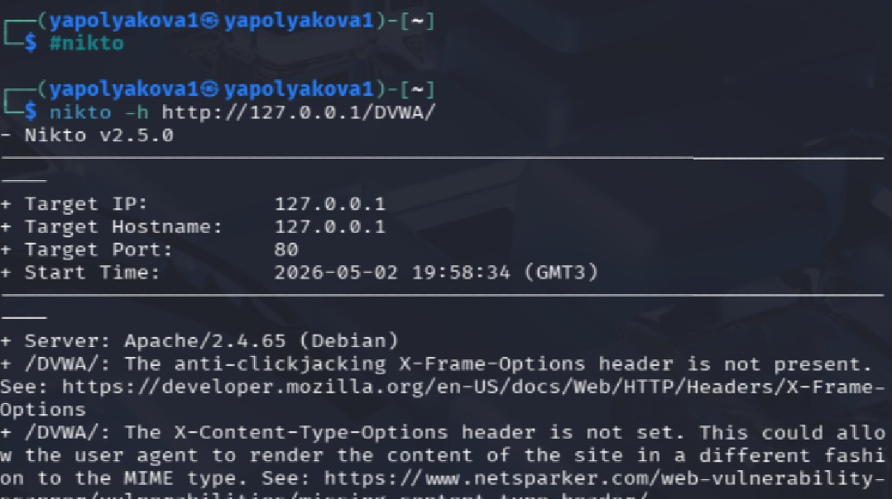

---
## Author
author:
  name: Полякова Юлия Александровна
  degrees: ---
  orcid: 0009-0002-3294-7664
  email: 1132243102@rudn.ru
  affiliation:
    - name: Российский университет дружбы народов
      country: Российская Федерация
      postal-code: 117198
      city: Москва
      address: ул. Миклухо-Маклая, д. 6

## Title
title: "Индивидуальный проект"
subtitle: "Этап №4"
license: "CC BY"
---

# Цель работы

Просканировать веб-приложение DVWA на уязвимости с помощью сканера безопасности nikto.

# Выполнение этапа проекта

Этап выполнен с использованием ресурса [@parasram_book]

1. Чтобы выполнить задание, нужно проверить, что веб-приложение и база данных запущены. Поэтому мы в терминале запускаем их командами, представленными на скрине. Затем в браузере переходим по ссылке **http://localhost/DVWA**. Потом логинимся и в настройках безопасности в меню слева внизу поставим уровень low, чтобы было проще показать работу nikto, хотя это необязательно. ([рис. @fig-001])

{#fig-001 width=65%}

2. Запускаем сканер командой **#nikto** в консоли. Для сканирования цели вводим **nikto -h цель**. Здесь в качестве цели я поставила адрес приложения. В самом начале сканер выводит данные о цели, затем ищет уязвимости ([рис. @fig-002])

{#fig-002 width=65%}

3. Можно также запустить так, как показано в методичке: nikto -h цель -p порт, где цель - домен или IP-адрес целевого сайта, а порт - порт, на котором запущен сервис. ([рис. @fig-003])

{#fig-003 width=65%}

4. Рассмотрим уязвимости, которые нашел сканер. Я перевела их на русский для удобства. Как видим, их достаточно много, в основном - это различные бэкдоры и недостаточный функционал для защиты. Также интересен код OSVDB-561, его можно проверить на специальном сайте, указанном в методичке. ([рис. @fig-004])

{#fig-004 width=65%}

# Вывод

Были успешно установленны самые главные уязвимости веб-приложения DVWA с помощью сканера безопасности nikto.

# Список литературы{.unnumbered}

::: {#refs}
:::

