---
## Author
author:
  name: Полякова Юлия Александровна
  degrees: ---
  orcid: 0009-0002-3294-7664
  email: 1132243102@rudn.ru
  affiliation:
    - name: Российский университет дружбы народов
      country: Российская Федерация
      postal-code: 117198
      city: Москва
      address: ул. Миклухо-Маклая, д. 6
## Title
title: Индивидуальный проект
subtitle: Этап №5. Использование Burp Suite
license: CC BY
date: today
date-format: "YYYY-MM-DD" # Example: 2025-09-06
---

# Информация

## Докладчик

:::::::::::::: {.columns align=center}
::: {.column width="70%"}

  * Полякова Юлия Александровна
  * студент
  * группа: НКАбд-04-24
  * Российский университет дружбы народов им. П. Лумумбы
  * [1132243102@rudn.ru](mailto:1132243102@rudn.ru)
  * <https://juliamaffin123.github.io/>

:::
::: {.column width="30%"}

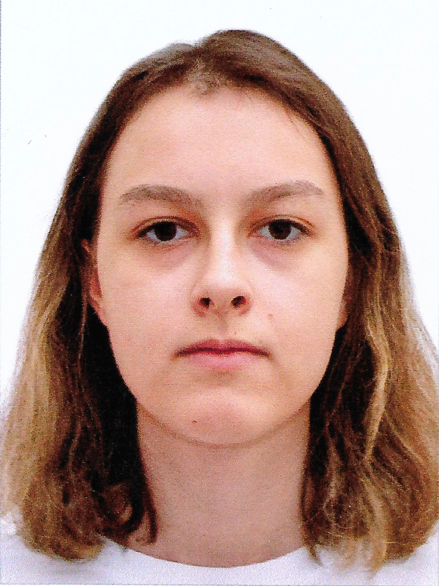

:::
::::::::::::::

# Вводная часть

## Актуальность

- Изучение Burp Suite позволит увидеть демонстрацию реальных возможностей злоумышленника, проникающего в веб-приложения.

## Объект и предмет исследования

- Burp Suite

- DVWA (Damn Vulnerable Web Application)

## Цели и задачи

Продемонстрировать возможности злоумышленника, проникнув в веб-приложение DVWA с помощью Burp Suite.

Задачи:

- Запустить DVWA
- Атаковать с помощью Burp Suite

## Материалы и методы

- Средство для развертывания в.м. VirtualBox
- Kali Linux
- Burp Suite
- DVWA

# Выполнение работы

## Запуск веб-сервера и Burp Suite

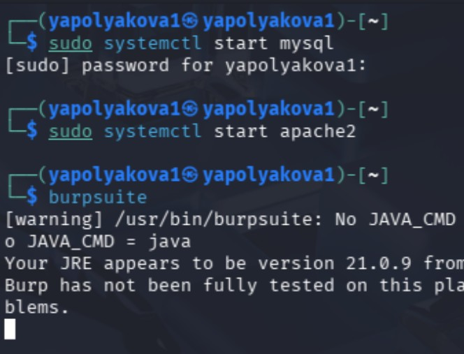{#fig-001 width=55%}

## Проверка Proxy Settings

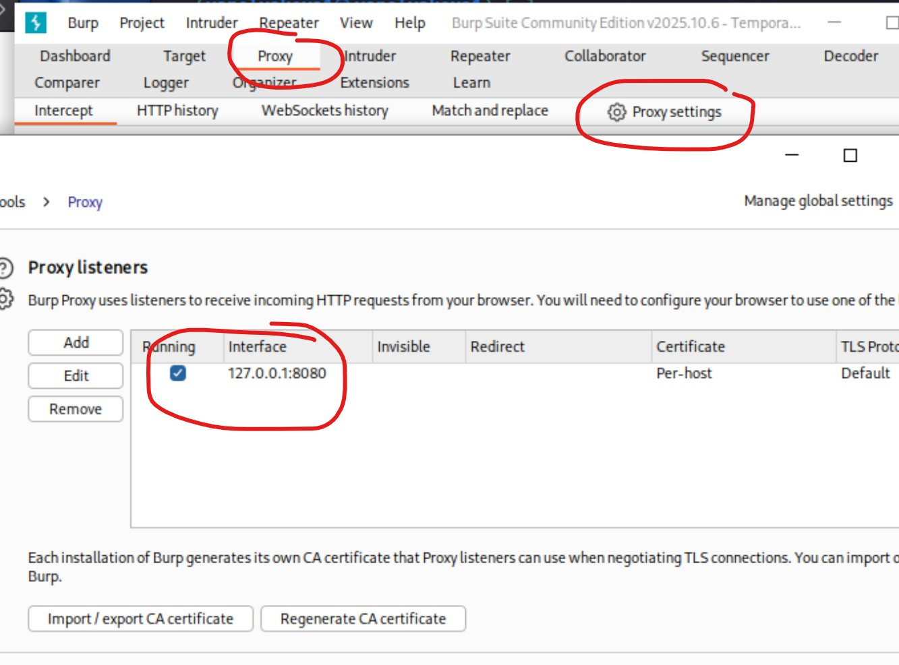{#fig-002 width=45%}

## Проверка Intercept on

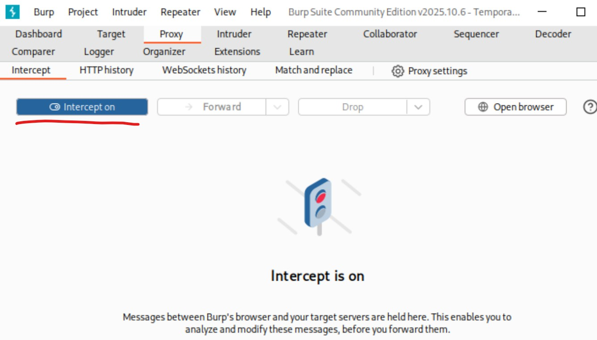{#fig-003 width=55%}

## Настройка браузера 1

{#fig-004 width=60%}

## Настройка браузера 2

{#fig-005 width=40%}

## Загрузка DVWA

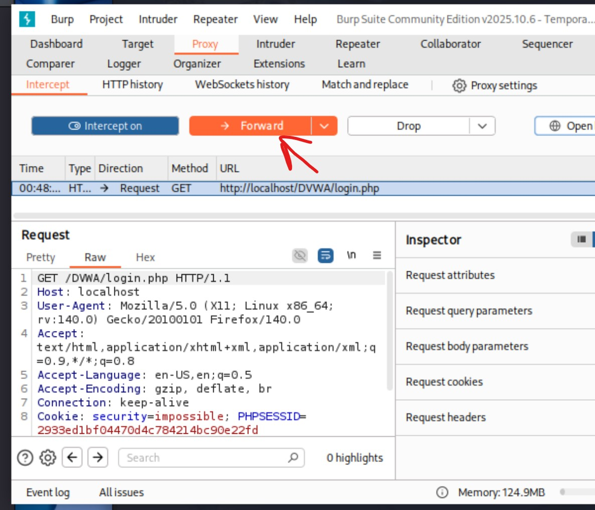{#fig-006 width=40%}

## Данные во вкладке Target

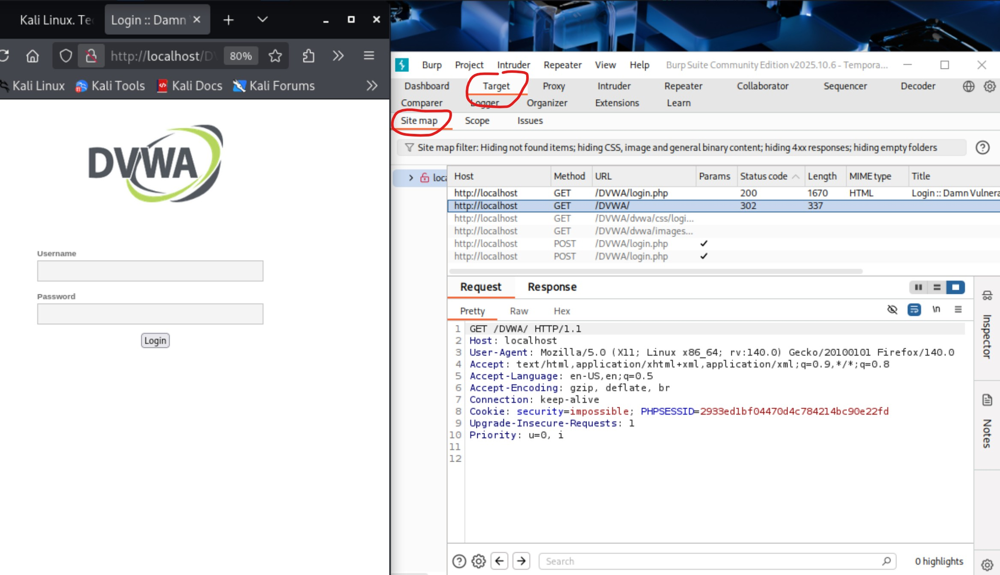{#fig-007 width=45%}

## Получаем запрос в форму входа

{#fig-008 width=45%}

## Send to Intruder

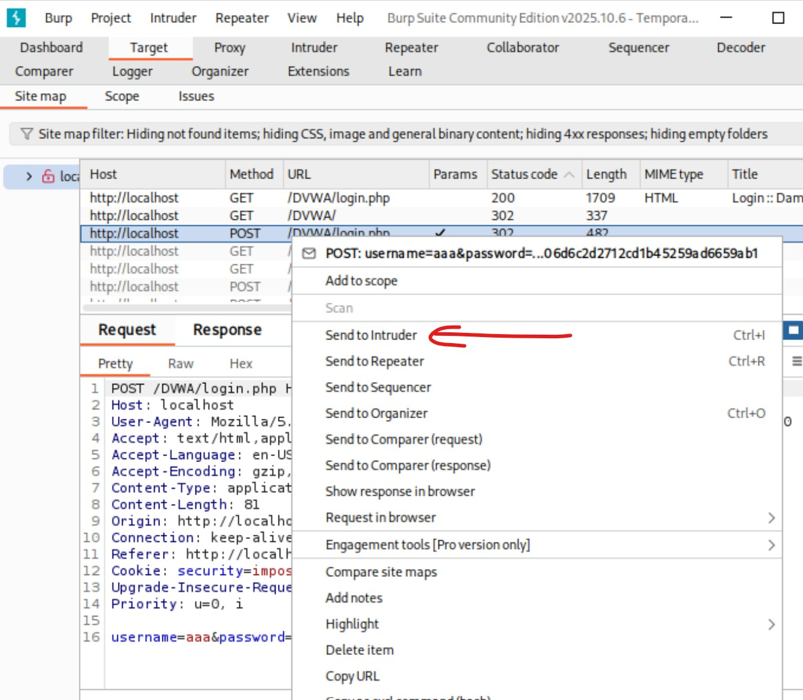{#fig-009 width=40%}

## Добавляем позиции

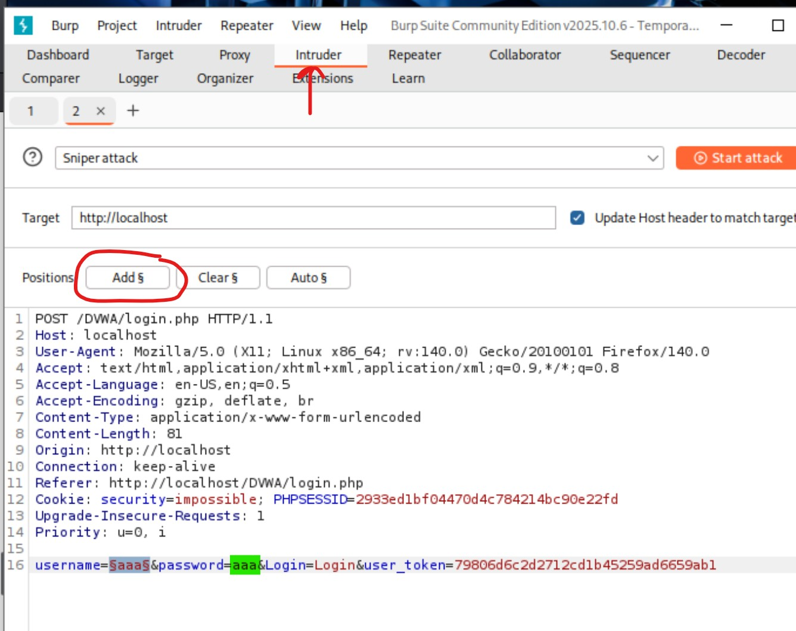{#fig-010 width=40%}

## Проверяем тип атаки

{#fig-011 width=40%}

## Добавляем payloads сеты

{#fig-012 width=40%}

## Изучение атак 1

При неверных данных перенаправление снова на login.php

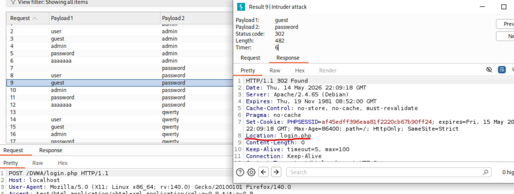{#fig-013 width=65%}

## Изучение атак 2

В удачной атаке видим пперенаправление на index.php

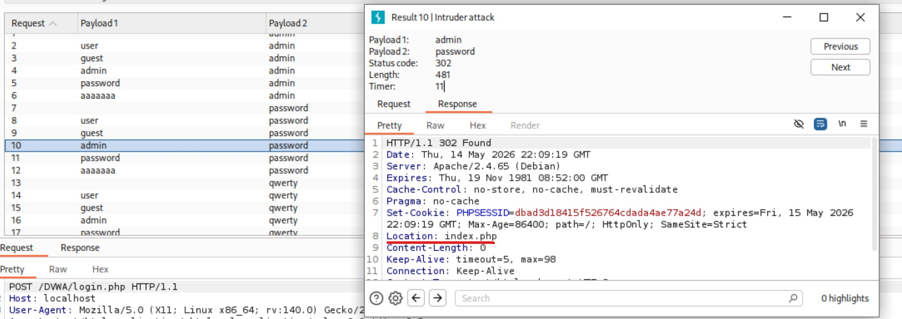{#fig-014 width=65%}

## Send to Repeater

{#fig-015 width=70%}

## Send

{#fig-016 width=40%}

## Follow redirection

{#fig-017 width=40%}

## HTML код страницы

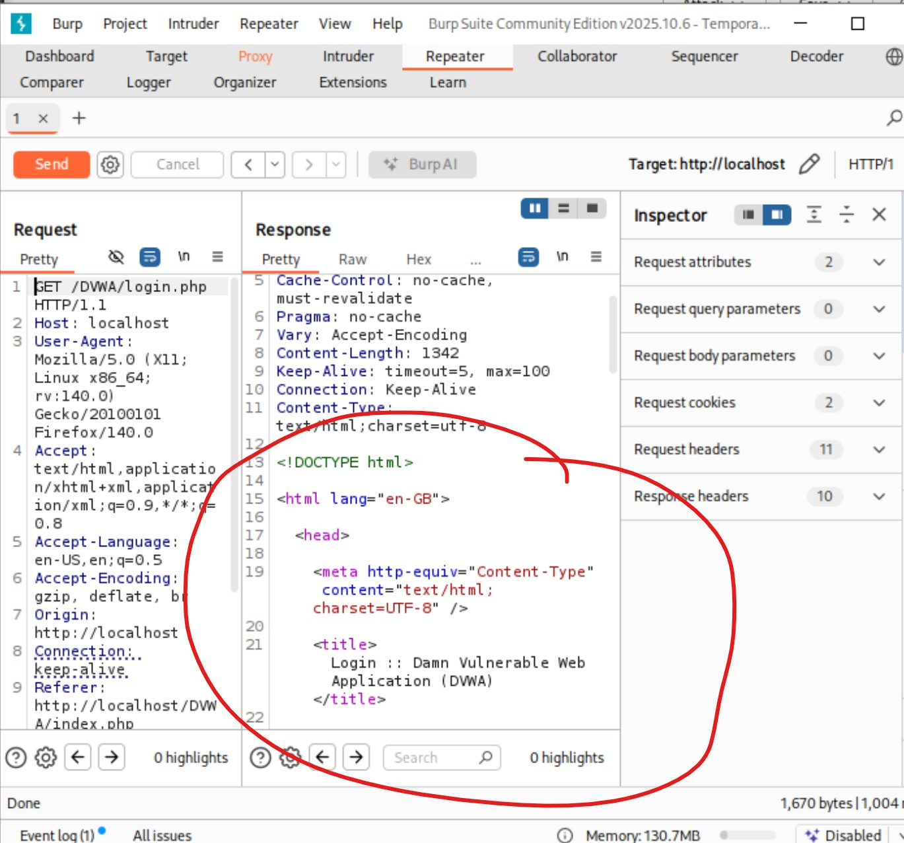{#fig-018 width=40%}

## Вкладка Render

{#fig-019 width=40%}

## Выводы

Продемонстрировать возможности злоумышленника при взломе учетных данных в веб-приложении DVWA с помощью Burp Suite.
