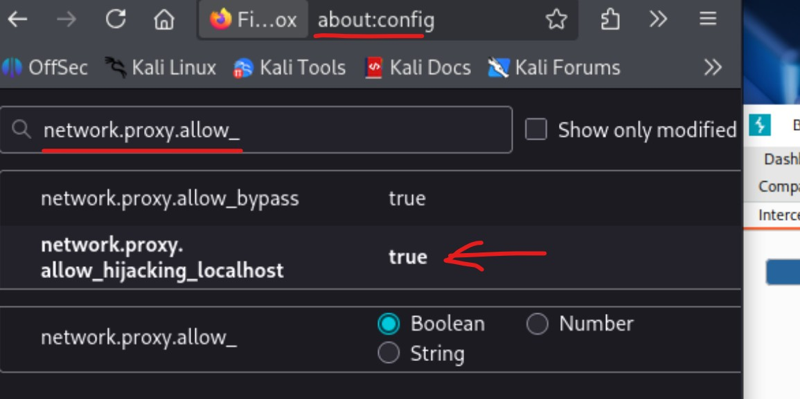
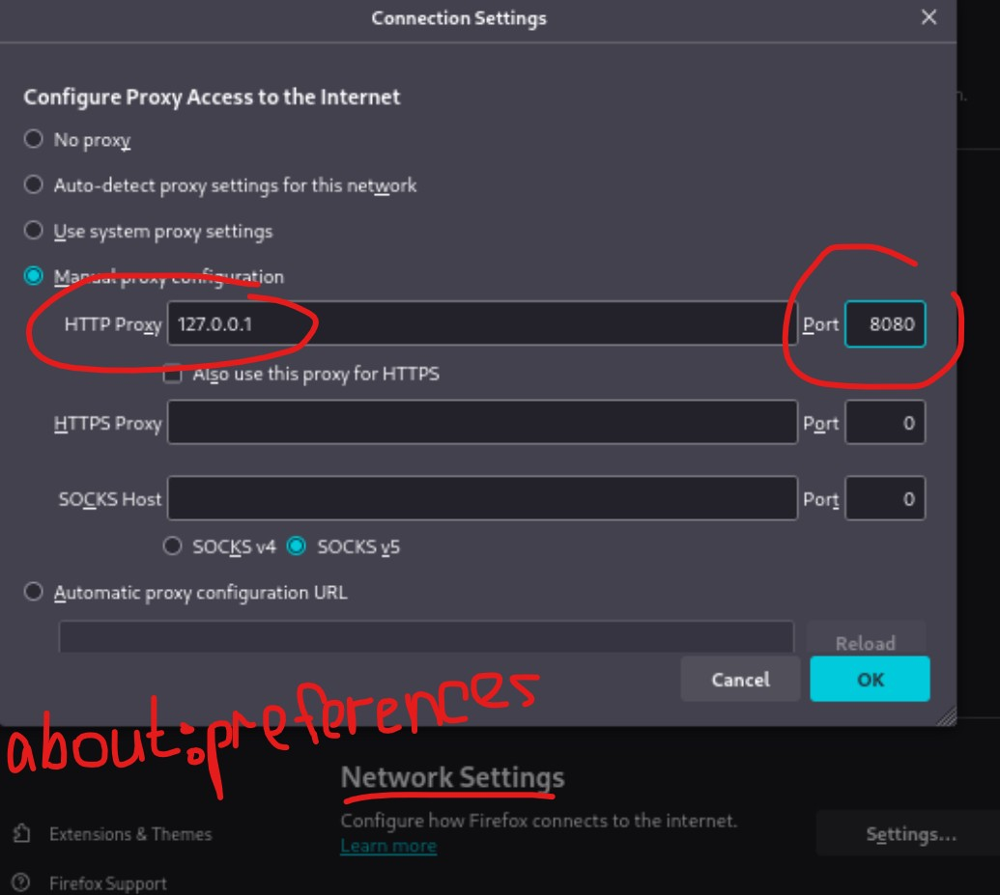
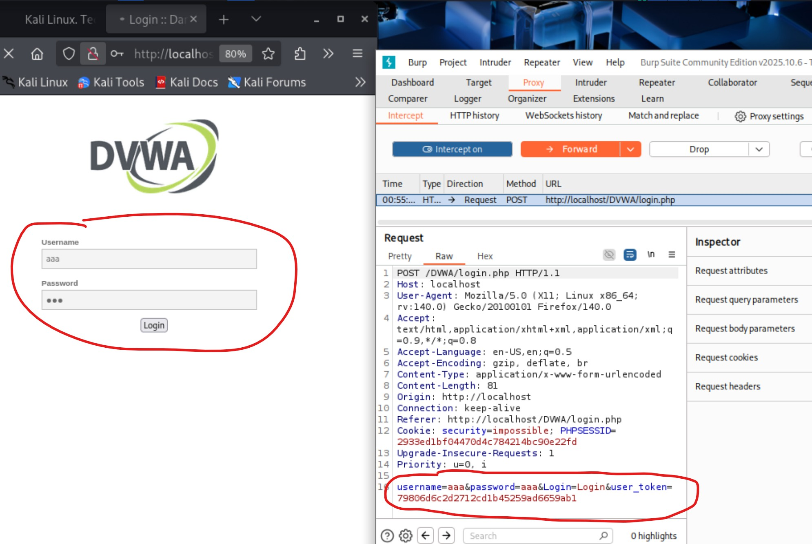
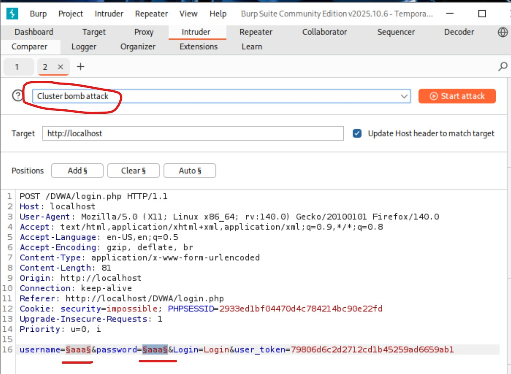
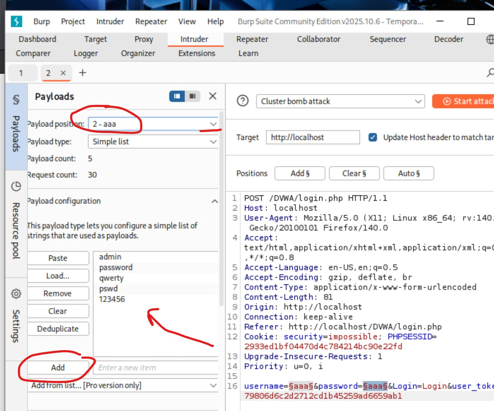
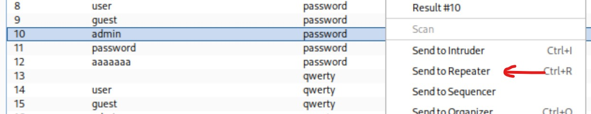
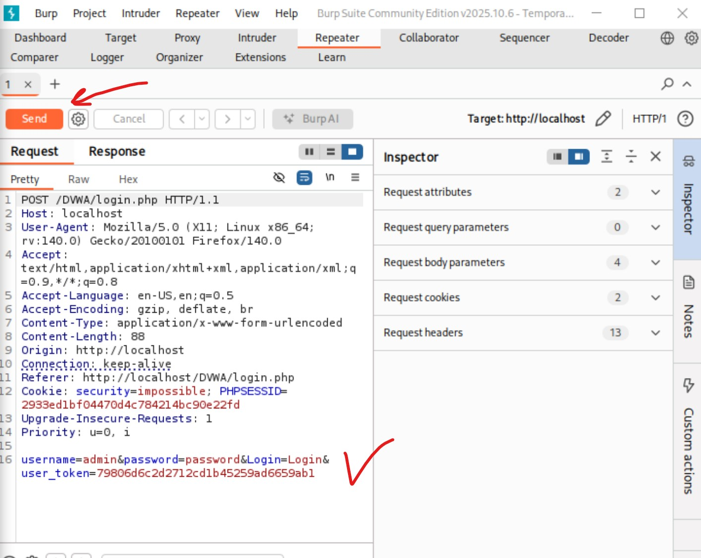
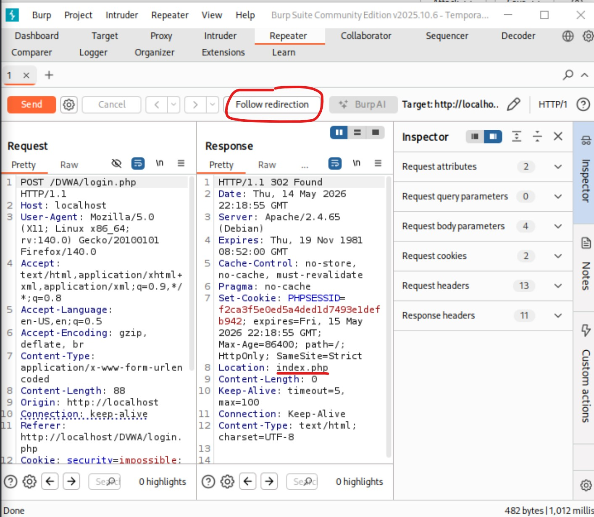
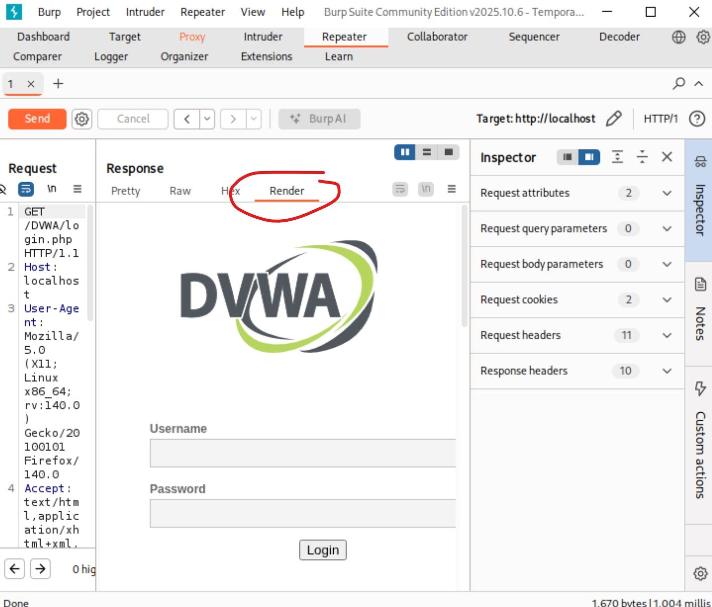

---
## Author
author:
  name: Полякова Юлия Александровна
  degrees: ---
  orcid: 0009-0002-3294-7664
  email: 1132243102@rudn.ru
  affiliation:
    - name: Российский университет дружбы народов
      country: Российская Федерация
      postal-code: 117198
      city: Москва
      address: ул. Миклухо-Маклая, д. 6

## Title
title: "Индивидуальный проект"
subtitle: "Этап №5"
license: "CC BY"
---

# Цель работы

Продемонстрировать возможности злоумышленника, проникнув в веб-приложение DVWA с помощью Burp Suite.

# Выполнение этапа проекта

Этап выполнен с использованием ресурса [@parasram_book]

1. Чтобы выполнить задание, нужно проверить, что веб-приложение и база данных запущены. Поэтому мы в терминале запускаем их командами, представленными на скрине. Затем запускаем Burp Suite командой burpsuite через консоль. Принимаем все настройки, ждем запуска приложения. ([рис. @fig-001])

{#fig-001 width=65%}

2. Переходим во вкладку Proxy, Proxy Settings и проверяем, что для IP установлено значение localhost IP, а номер порта - 8080 ([рис. @fig-002])

{#fig-002 width=65%}

3. Переходжим во вкладку Intercept и проверяем, что перехват включен (Intercept on) ([рис. @fig-003])

{#fig-003 width=65%}

4. Затем проверим, что в браузере в конфигурационном файле разрешен доступ к localhost, если нет, то ставим true ([рис. @fig-004])

{#fig-004 width=65%}

5. Также в браузере в настройках сети проверяем, что верно настроен порт, прописываем туда 127.0.0.1 и порт 8080. ([рис. @fig-005])

{#fig-005 width=65%}

6. В браузере переходим в DVWA, в Burp Suite несколько раз нажимаем Forward для полной загрузки страницы, уже видим некоторые данные запроса. ([рис. @fig-006]).

{#fig-006 width=65%}

7. Теперь во вкладке Target (Цель) и Site map будут некоторые данные ([рис. @fig-007])

{#fig-007 width=65%}

8. В форму входа вводим любые данные, отправляем, нажимаем несколько раз Forward, в процессе получаем формат запроса, который будем использовать далее ([рис. @fig-008])

{#fig-008 width=65%}

9. Дальше находим наш POST запрос, нажимаем правой кнопкой мыши и Send to Intruder ([рис. @fig-009])

{#fig-009 width=65%}

10. Внутри вкладки Intruder с помощью кнопки Add добавляем поле отслеживания на выделенные места в запросе. В эти места будут подставляться данные, то есть выделяем логин и пароль. ([рис. @fig-010]).

{#fig-010 width=65%}

11. Ставим Cluster bomb attack. ([рис. @fig-011])

{#fig-011 width=65%}

12. Во вкладке Payloads для каждого списка (поля, которое мы ранее выделили) в конфигурации добаляем разлдичные варианты логинов и паролей ([рис. @fig-012])

{#fig-012 width=65%}

13. Нажимаем Start attack, начинают появляться результаты попытки атак, все с кодом 302 - это перенаправление. Теперь кликаем на разные попытки атак два раза и смотрим в Response, куда мы перенаправляемся. При неверных данных перенаправление снова на login.php ([рис. @fig-013])

{#fig-013 width=65%}

14. В удачной атаке видим пперенаправление на index.php ([рис. @fig-014])

{#fig-014 width=65%}

15. Кликаем правой кнопкой на атаку и Send to Repeater. Это инструмент для ручного изменения HTTP-запросов и данных, отправляемых в этих запросах. ([рис. @fig-015])

{#fig-015 width=65%}

16. Нажимаем Send запроса с нашими верными данными ([рис. @fig-016])

{#fig-016 width=65%}

17. Затем продолжаем кнопкой Follow redirection ([рис. @fig-017])

{#fig-017 width=65%}

18. Должен появиться HTML код страницы. ([рис. @fig-018])

{#fig-018 width=65%}

19. Во вкладке Render ее можно отобразить ([рис. @fig-019])

{#fig-019 width=65%}

# Вывод

Продемонстрировать возможности злоумышленника при взломе учетных данных в веб-приложении DVWA с помощью Burp Suite.

# Список литературы{.unnumbered}

::: {#refs}
:::

